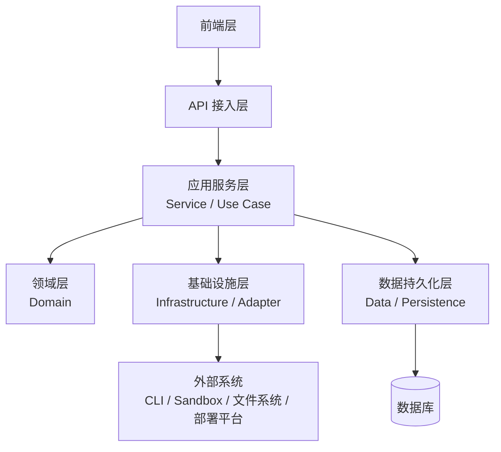
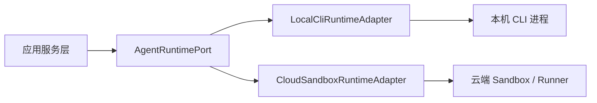
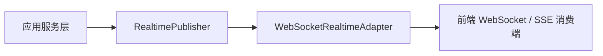
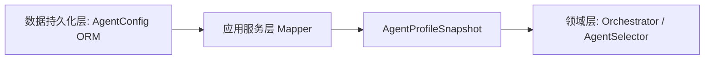
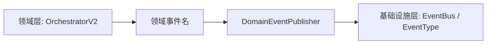

# ADR-0005: 目标架构与整体架构约束

**日期**: 2026-05-25
**更新**: 2026-06-22
**状态**: Accepted

## 决策

AgentHub 的目标架构采用六层架构：

1. 前端层
2. API 接入层
3. 应用服务层
4. 领域层
5. 基础设施层
6. 数据持久化层

不再把 Runtime / Configuration 单独列为一层或一张横切平面图。配置、凭据、Secret、Provider Registry、环境策略和依赖装配属于**基础设施层**，由系统启动入口和基础设施模块负责提供给 API、应用服务、外部适配器和数据连接。

也就是说：

- Service / Use Case 负责业务流程编排。
- Domain 负责核心业务规则。
- Infrastructure / Adapter 负责外部系统、运行环境、配置、凭据和 Provider 适配。
- Data / Persistence 负责数据库、ORM、迁移和查询形状。

## 目标架构图

- 前端层只通过 HTTP、SSE、WebSocket 等接口访问 API 接入层。
- API 接入层负责接入、认证、租户校验、参数校验和响应序列化，保持薄层。
- 应用服务层负责一次用户意图的完整业务流程，例如发送消息、群聊编排、Run/Task/Process 状态推进、Artifact 工作流和部署工作流。
- 领域层只沉淀稳定业务规则，例如 Orchestrator、ContextManager、AgentSelector、ExecutionPlanner、Plan 和 prompt policy。
- 基础设施层封装外部能力，包括 CLI、sandbox、workspace、文件系统、事件/实时推送、runner provider、deployment provider、配置、凭据和 Secret。
- 数据持久化层封装数据库相关能力，包括 SQLAlchemy models、migration、repository/query shape、SQLite 和未来 PostgreSQL。
- 领域层不依赖基础设施层，也不依赖数据持久化层；需要数据时由应用服务层读取并映射为领域需要的纯数据结构。

## 架构模块职责

| 架构模块 | 职责 | 当前示例 |
| --- | --- | --- |
| 前端层 | 多端 UI、聊天交互、状态管理、REST/SSE/WS client | `frontend/src/`, `desktop/`, `mobile/` |
| API 接入层 | HTTP/SSE/WS 接入、认证、租户校验、参数校验、响应序列化 | `backend/app/api/`, `backend/app/main.py` |
| 应用服务层 | 用户请求编排：single/group、local/cloud runtime、Run/Task/Process、Artifact、Approval、Delivery | `backend/app/application/`, `backend/app/services/chat_service_impl.py`, `single_cli_chat_stream.py`, `group_chat_stream.py`, `run_service.py` |
| 领域层 | 稳定业务规则：Orchestrator、ContextManager、ExecutionPlanner、AgentSelector、Plan 和 prompt policy | `backend/app/domain/` |
| 基础设施层 | 外部能力与运行环境适配：CLI、workspace、runtime、EventBus/realtime、runner、deployment、config、credentials、secrets、provider registry | `backend/app/agents/`, `backend/app/event_bus/`, `backend/app/infrastructure/`, `backend/app/config.py`, provider/credential/secret modules |
| 数据持久化层 | 长期状态和运行状态：ORM models、migrations、SQLite、未来 PostgreSQL | `backend/app/models/`, `backend/app/database.py`, `backend/migrations/` |

## 依赖规则

1. **API 接入层保持薄层**
   API 接入层只处理协议接入和请求边界，不承载 local/cloud、single/group、Run/Task/Process 等业务分流。

2. **应用服务层负责流程编排**
   应用服务层协调领域层、基础设施层和数据持久化层。它是后端业务流程入口，不是所有业务规则的堆放处。

3. **领域层保持纯净**
   领域层不依赖 FastAPI、WebSocket、SQLAlchemy session、真实 CLI 进程、文件系统、应用服务、基础设施模块或数据库模型。领域层需要的 Agent 信息应由应用服务层映射为 `AgentProfileSnapshot` 等纯数据结构。

4. **基础设施层隔离外部世界**
   CLI stdout/stderr、文件系统、cloud sandbox、deployment provider、system model、配置、凭据和 Secret 等不稳定外部能力必须经基础设施层标准化后进入系统。

5. **数据持久化层只处理状态存取**
   数据持久化层保存业务状态和运行状态，不承载业务编排，也不决定运行策略。

6. **实时推送是基础设施能力，不是 API 反向依赖**
   Service/Application 不应直接 import API WebSocket manager。实时事件应通过 `RealtimePublisher` 等 seam 发布，再由 WebSocket/SSE adapter 推送。

7. **Run / Task / Process 是运行状态主干**
   用户可见运行状态以 Run 和 RunTask 为准，底层执行以 RunProcess 或 RuntimeRun 为准。

## 核心架构接口

当前目标架构不要求先定义大量 ABC。只有当存在两个以上真实适配器，或 seam 对测试/扩展有实际价值时，才引入显式接口。当前最重要的 seam 是：

### AgentRuntimePort

用途：让应用服务层以统一方式启动本机 CLI 或云端 sandbox runtime。

### RealtimePublisher

用途：让应用服务层发布 session 级实时事件，而不是直接依赖 API WebSocket manager。

### AgentProfileSnapshot

用途：阻断领域层对 SQLAlchemy `AgentConfig` 的直接依赖。

当前实现：

- `backend/app/domain/agent_profile.py` 定义领域层纯数据结构。
- `backend/app/application/agent_profile_mapper.py` 在应用服务边界完成 ORM 到领域快照的映射。

### DomainEventPublisher

用途：阻断领域层对基础设施 `EventBus` / `EventType` 的直接依赖。

当前实现：

- `backend/app/domain/events.py` 定义领域事件名和发布协议。
- `backend/app/infrastructure/domain_event_publisher.py` 把领域事件名映射为基础设施 `EventType`。

## 实施指引

新增或重构代码时优先遵循以下放置规则：

| 变更类型 | 建议位置 |
| --- | --- |
| 新 REST/SSE/WS endpoint | `backend/app/api/` |
| 一次用户命令或业务工作流 | `backend/app/application/` 或现有 `backend/app/services/`，后续可按 use case 拆分 |
| Orchestrator、Context、Plan、Agent 选择规则 | `backend/app/domain/` |
| CLI、runner、deployment、workspace、system model、config、credential、secret 适配 | `backend/app/agents/`, `backend/app/infrastructure/`, provider/credential/secret modules |
| ORM model、migration、DB 查询形状 | `backend/app/models/`, `backend/migrations/` |
