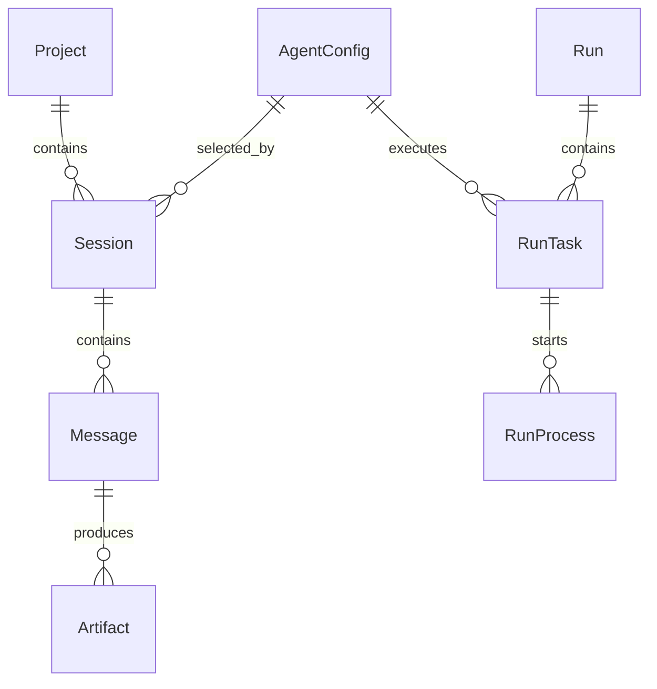
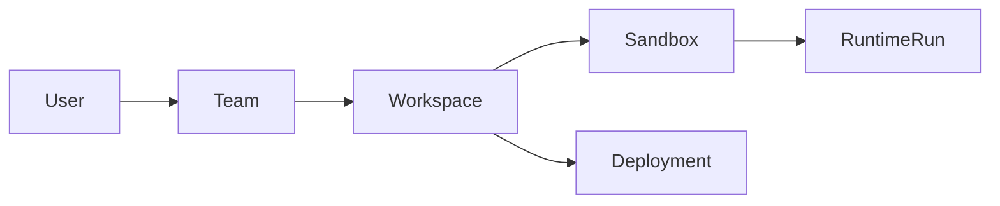

# ADR-0012: 数据持久化模型 —— SQLite + SQLAlchemy + Project-first 数据结构

**日期**: 2026-06-22  
**状态**: Accepted  
**相关**: [ADR-0001](0001-tech-stack-selection.md), [ADR-0009](0009-project-workspace-model.md), [ADR-0011](0011-agent-engine-skill-model.md), [architecture/data-model](../architecture/data-model.md)

## 背景

AgentHub 的 P1 主线是本机桌面版：用户启动本地桌面端，创建 Project，绑定本机 workspace，然后让 Claude Code、Codex、OpenCode 等真实 CLI Agent 在该 workspace 中执行。

这带来几个持久化要求：

1. 本机桌面版必须尽量零部署，不能要求用户额外安装数据库服务。
2. 数据库需要保存 Project、Session、Message、AgentConfig、Artifact、Run/Task/Process 等核心协作数据。
3. 数据结构必须支持后续 SaaS：用户、团队、云端 workspace、sandbox runtime、preview 和 deployment。
4. 项目快速迭代中需要迁移脚本和 ORM 模型，不能把业务逻辑绑定到某个数据库的私有语法上。
5. 消息搜索需要轻量全文搜索能力。

## 决策

AgentHub 当前采用：

```text
SQLite + SQLAlchemy 2.0 async + aiosqlite + migrations
```

默认数据库位置由 `backend/app/config.py` 的 `database_url` 配置：

```text
sqlite+aiosqlite:///./data/agenthub.db
```

核心数据模型采用 Project-first：



同时保留 SaaS 扩展表组：



可演进字段采用 `metadata_json`、`config_json`、`depends_on_json` 等 JSON 文本字段保存，用于降低快速迭代阶段的迁移成本。强关系、生命周期状态和查询关键字段仍显式建列。

消息全文搜索采用 SQLite FTS5 虚拟表 `messages_fts`。

## 为什么选择 SQLite

选择 SQLite 的原因：

| 原因 | 说明 |
| --- | --- |
| 本机优先 | P1 数据和 Agent 执行都在用户电脑闭环，SQLite 单文件数据库足够支撑。 |
| 零部署 | 用户不需要安装 MySQL/PostgreSQL、配置端口、账号和服务。 |
| Demo 稳定 | 课程答辩和桌面端演示不依赖外部数据库服务。 |
| 开发效率 | 本地迁移、备份、排查和重置成本低。 |
| 与 SQLAlchemy 兼容 | ORM 模型保留未来迁移到 PostgreSQL 的空间。 |
| FTS5 可用 | 满足消息搜索的轻量全文检索需求。 |

## 备选方案

### PostgreSQL

优点：

- 更适合 SaaS 生产环境。
- 并发写入、索引能力、JSONB、权限和运维生态更强。
- 适合多租户和大规模团队使用。

未选择作为 P1 默认数据库的原因：

- 本机桌面端需要额外数据库服务，破坏零部署体验。
- 答辩 Demo 和用户试用时配置成本更高。
- 当前 P1 数据规模和并发写入压力不需要 PostgreSQL。

未来迁移条件：

- SaaS 进入真实多用户生产部署。
- 需要高并发写入、大规模消息检索、复杂审计查询。
- 需要数据库层更强的租户隔离、备份恢复和观测能力。

### MySQL

优点：

- 部署广泛，团队熟悉度高。
- 可支撑常规 Web 业务。

未选择原因：

- 对本机桌面版同样需要额外服务。
- 项目后续如果走 SaaS，多租户、JSON 查询、全文搜索和复杂约束上 PostgreSQL 更匹配。
- 没有比 PostgreSQL 更明显的架构收益。

### 直接文件存储 JSON

优点：

- 实现简单。
- 本机便携。

未选择原因：

- 难以表达 Project / Session / Message / Artifact / Run 之间的关系。
- 搜索、分页、迁移、并发写入和数据修复成本高。
- 不适合后续 SaaS 扩展。

## 数据模型决策

### Project-first 模型

`projects` 是顶层组织边界，所有聊天、文件、产物和执行记录都归属到 Project。原因见 [ADR-0009](0009-project-workspace-model.md)。

### 消息级 Artifact

Artifact 绑定具体 `message_id`，而不是只绑定 Project。原因见 [ADR-0010](0010-message-level-artifact-experience.md)。

### Run / Task / Process 分层

一次用户请求对应 `runs`，多 Agent 或 Orchestrator DAG 节点对应 `run_tasks`，真实 CLI 进程对应 `run_processes`。

这样可以分别回答：

- 用户这轮请求整体是否完成？
- 哪个 Agent / phase / task 正在运行？
- 具体底层 CLI 进程是否启动、退出或失败？

### Agent Profile 独立建模

`agent_configs` 保存用户可见 Agent Profile，而不是只保存模型名或 CLI 名。原因见 [ADR-0011](0011-agent-engine-skill-model.md)。

### JSON metadata 字段

使用 JSON 文本字段承载可演进信息，例如：

- `metadata_json`
- `config_json`
- `depends_on_json`
- `logs_json`
- `provider_metadata_json`

约束：

- 稳定查询条件必须显式建列。
- JSON 字段只用于扩展 metadata、外部 provider 配置、trace 或历史兼容信息。
- 不能把核心关系藏进 JSON。

### Migration Runner

项目保留迁移脚本和 `_migrations_history` 表，用于记录迁移是否已执行。启动时 `backend/app/main.py` 会调用 migration runner。

## 影响

正面影响：

- P1 桌面端可以单机运行，部署和演示成本低。
- 数据模型足够表达 AgentHub 的 IM、Agent 执行、Artifact 和 workspace 链路。
- SQLAlchemy 让 Service 层不直接依赖 SQLite 私有实现。
- SaaS 相关表可以在同一领域模型下先完成产品切片。

成本：

- SQLite 不适合高并发多人写入。
- SaaS 生产化时需要迁移 PostgreSQL 或其他托管数据库。
- JSON 文本字段需要靠服务层保证结构约束。
- FTS5 会生成内部影子表，schema 汇总时需要区分业务表和 SQLite 内部表。

## 迁移到 PostgreSQL 的策略

如果后续切换 PostgreSQL，建议遵循：

1. 保持 SQLAlchemy 模型作为主要接口。
2. 为 JSON 文本字段评估是否迁移为 JSONB。
3. 将 FTS5 搜索迁移到 PostgreSQL full text search 或外部搜索服务。
4. 先迁移 SaaS 云端部署，不影响 P1 本机 SQLite。
5. 保留本机桌面版 SQLite 作为 local edition 默认数据库。

## 当前事实源

当前所有表、表组和关系说明不放在本 ADR 中维护，权威事实源是：

- [docs/architecture/data-model.md](../architecture/data-model.md)
- `backend/app/models/`
- `backend/migrations/`

本 ADR 只记录为什么采用当前持久化策略。
