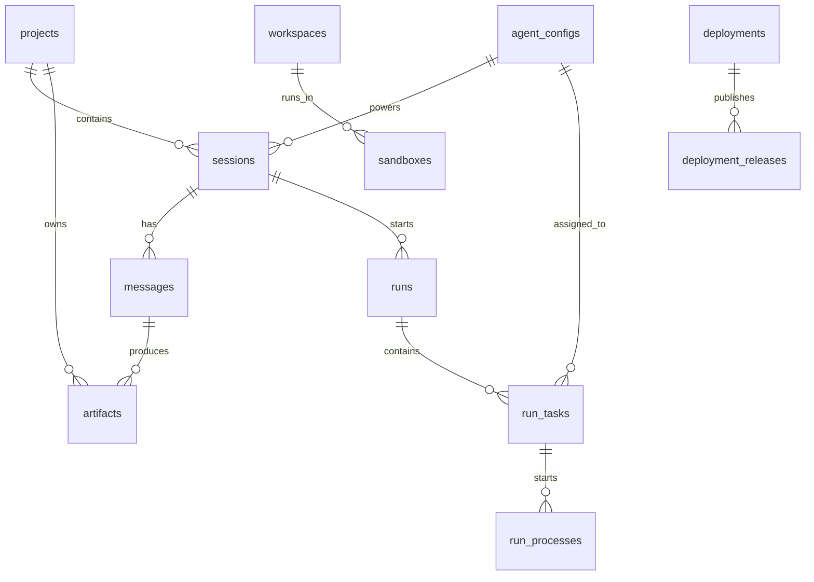

# AgentHub 数据模型

> 本文档描述当前数据库事实。为什么选择 SQLite 和 Project-first 持久化模型，见 [ADR-0012](../adr/0012-data-persistence-model.md)。

## 数据库配置

默认配置在 `backend/app/config.py`：

```text
database_url = sqlite+aiosqlite:///./data/agenthub.db
```

ORM 模型位于：

```text
backend/app/models/
```

迁移脚本位于：

```text
backend/migrations/
```

## 核心关系图



## 表分组总览

当前本地 SQLite 物理 schema 包含：

- 44 张业务模型表。
- 1 张迁移历史表：`_migrations_history`。
- 1 张 FTS 虚拟表：`messages_fts`。
- 5 张 SQLite FTS5 内部影子表：`messages_fts_config/content/data/docsize/idx`。

## Project / Session / Message

| 表名 | 作用 | 关键字段 |
| --- | --- | --- |
| `projects` | Project 顶层边界，绑定本机或云端 workspace | `id`, `name`, `workspace_path`, `workspace_mode`, `workspace_id`, `team_id`, `owner_user_id`, `status`, `metadata_json` |
| `sessions` | 单聊或群聊会话 | `id`, `project_id`, `agent_config_id`, `title`, `mode`, `is_pinned`, `archived_at`, `unread_count` |
| `session_members` | 群聊成员关系 | `session_id`, `agent_config_id` |
| `messages` | 用户消息、Agent 输出、系统消息 | `id`, `session_id`, `role`, `content`, `content_type`, `source_type`, `source_id`, `metadata_json`, `parent_message_id`, `is_pinned` |
| `messages_fts` | 消息全文搜索虚拟表 | `content`, `agent_name`, `source_name` |

关系说明：

- 一个 Project 下有多个 Session。
- 一个 Session 下有多条 Message。
- 群聊通过 `session_members` 绑定多个 Agent。
- `messages.metadata_json` 承载引用、Artifact Bridge、Orchestrator execution、trace 等可演进信息。

## Agent Profile

| 表名 | 作用 | 关键字段 |
| --- | --- | --- |
| `agent_configs` | 用户可见 Agent Profile | `id`, `owner_user_id`, `name`, `description`, `system_prompt`, `rules`, `agent_type`, `cli_tool`, `executable`, `init_args`, `env_vars`, `toolset`, `context_policy`, `avatar`, `is_active` |
| `engine_sessions` | 底层 CLI engine 会话复用记录 | `session_id`, `agent_config_id`, `cli_tool`, `workspace_path`, `engine_session_id`, `metadata_json` |

关系说明：

- `agent_configs` 描述 Agent 的身份、规则、工具集和底层 Engine。
- `engine_sessions` 记录 Codex/OpenCode 等 CLI 的原生会话 ID 或 AgentHub 分配的会话 ID。

## Run / Task / Process / Approval

| 表名 | 作用 | 关键字段 |
| --- | --- | --- |
| `runs` | 一次用户请求或 Orchestrator 执行 | `id`, `session_id`, `project_id`, `mode`, `status`, `current_message_id`, `metadata_json` |
| `run_tasks` | Run 下的任务节点 | `id`, `run_id`, `session_id`, `agent_id`, `message_id`, `name`, `role`, `phase`, `status`, `depends_on_json`, `metadata_json` |
| `run_processes` | 真实 CLI 或 runtime 进程记录 | `id`, `run_id`, `task_id`, `process_id`, `pid`, `executable`, `cwd`, `status`, `exit_code` |
| `approval_checkpoints` | 人机确认节点 | `id`, `run_id`, `task_id`, `session_id`, `message_id`, `artifact_id`, `artifact_version`, `status`, `reason`, `metadata_json` |
| `orchestrator_plans` | Orchestrator 计划记录 | `id`, `session_id`, `run_id`, `status`, `normalized_plan_json`, `metadata_json` |

关系说明：

- `runs` 回答“这一轮请求整体状态是什么”。
- `run_tasks` 回答“哪个 Agent 的哪个任务处于什么状态”。
- `run_processes` 回答“底层真实进程是否启动、退出、失败”。
- `approval_checkpoints` 用于 Human-in-the-loop。

## Artifact / Collaboration

| 表名 | 作用 |
| --- | --- |
| `artifacts` | 消息级产物，绑定 `session_id`、`message_id`、`project_id` |
| `artifact_references` | Artifact 被评论、审批或其他资源引用 |
| `attachments` | 用户上传附件 |
| `comments` | 团队协作评论 |
| `notifications` | 用户通知 |
| `agent_template_sessions` | 对话式 Agent 创建草稿 |
| `git_sync_jobs` | Git 同步任务 |

`artifacts` 的关键字段：

```text
type, title, content, status, version, parent_artifact_id,
file_path, preview_id, source, confidence, task_id
```

## Workspace / Cloud Workspace

| 表名 | 作用 |
| --- | --- |
| `workspaces` | 云端 workspace 元数据 |
| `workspace_snapshots` | workspace 快照 |
| `workspace_imports` | 仓库或文件导入记录 |
| `workspace_restores` | 快照恢复记录 |
| `workspace_volumes` | 真实云 runtime 的隔离卷 |

本机 Project 直接使用 `projects.workspace_path`。云端 Project 使用 `projects.workspace_id` 指向 `workspaces`。

## Auth / Team / Audit

| 表名 | 作用 |
| --- | --- |
| `users` | 用户账号 |
| `auth_identities` | 登录身份 |
| `auth_sessions` | 登录会话和 refresh token |
| `teams` | 团队 |
| `team_members` | 团队成员和角色 |
| `audit_logs` | 审计日志 |

云端请求通过 AuthService、TenantGuard 和 TeamService 做权限过滤。

## Runtime / Sandbox

| 表名 | 作用 |
| --- | --- |
| `sandboxes` | 云端 sandbox 实例 |
| `runtime_runs` | 云端 runtime 执行记录 |
| `runtime_logs` | runtime 日志 |
| `secrets` | Secret 存储引用 |
| `cli_credential_configs` | SaaS 内置 CLI 凭据配置 |
| `quota_usages` | 配额使用 |
| `runner_nodes` | runner 节点 |

这些表支撑 SaaS cloud runtime，与 P1 本机 CLI runtime 共用上层 Project / Session / Agent / Message / Artifact 模型。

## Preview / Build / Deployment

| 表名 | 作用 |
| --- | --- |
| `preview_sessions` | Artifact 或 workspace 预览 session |
| `build_runs` | 构建任务 |
| `build_logs` | 构建日志 |
| `deployments` | 部署记录 |
| `deployment_targets` | 部署目标和 provider 配置 |
| `deployment_releases` | 发布版本 |
| `deployment_logs` | 部署日志 |

## Context / Maintenance

| 表名 | 作用 |
| --- | --- |
| `context_pack_snapshots` | 上下文包快照 |
| `_migrations_history` | 迁移执行历史 |

## SQLite FTS5 内部表

`messages_fts` 是虚拟表，会自动生成内部影子表：

```text
messages_fts_config
messages_fts_content
messages_fts_data
messages_fts_docsize
messages_fts_idx
```

这些表不应由业务代码直接读写。

## 设计约束

1. 核心关系必须显式建外键或字段，不应藏在 JSON 中。
2. JSON 字段用于 trace、provider 配置、metadata 和历史兼容。
3. Project 是顶层归属边界；新增资源优先考虑是否需要 `project_id`。
4. Session 是聊天边界；消息、运行状态和 Artifact 都应可追溯到 Session。
5. Artifact 必须能追溯到具体 Message。
6. Run / Task / Process 是运行控制和调试的核心链路，不应只靠前端临时状态表达。

