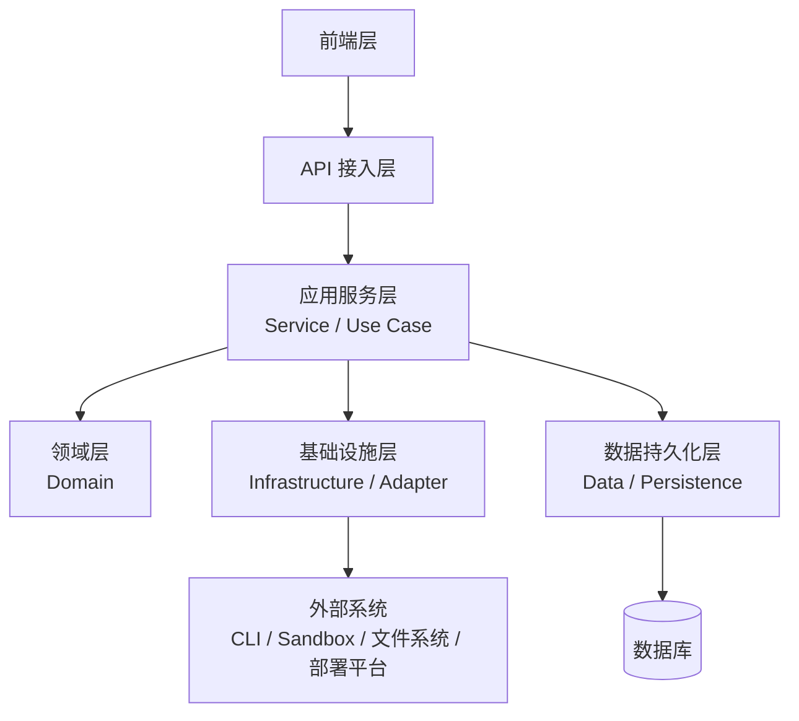
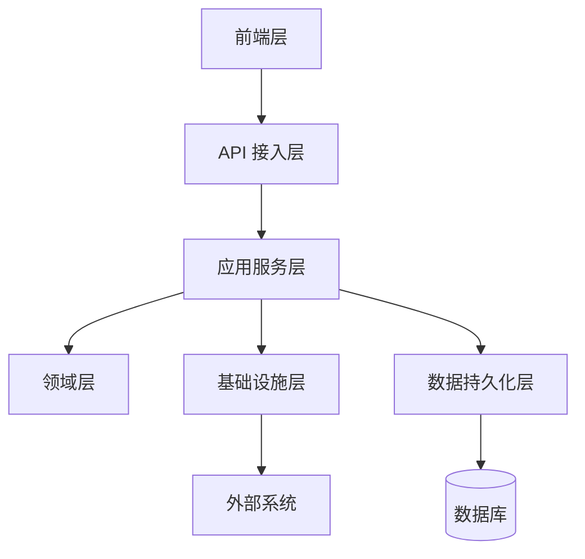
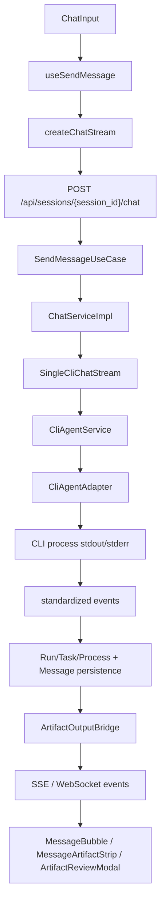
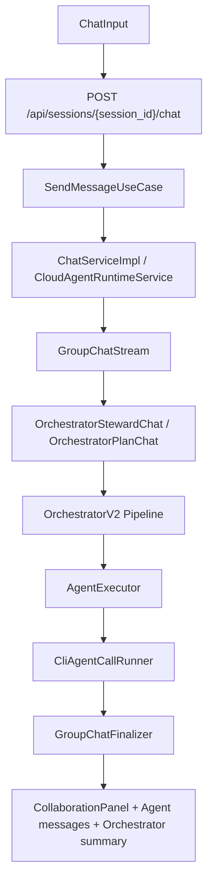
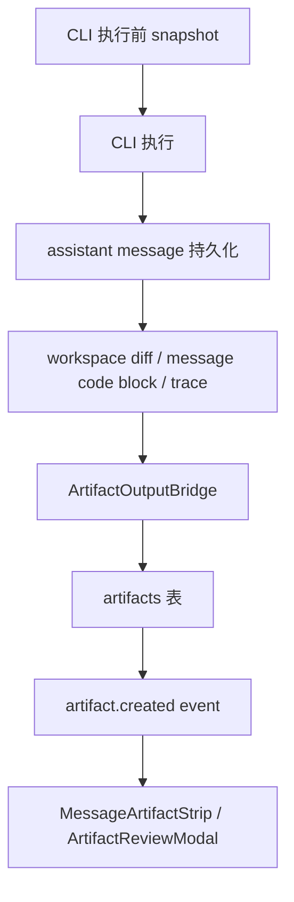
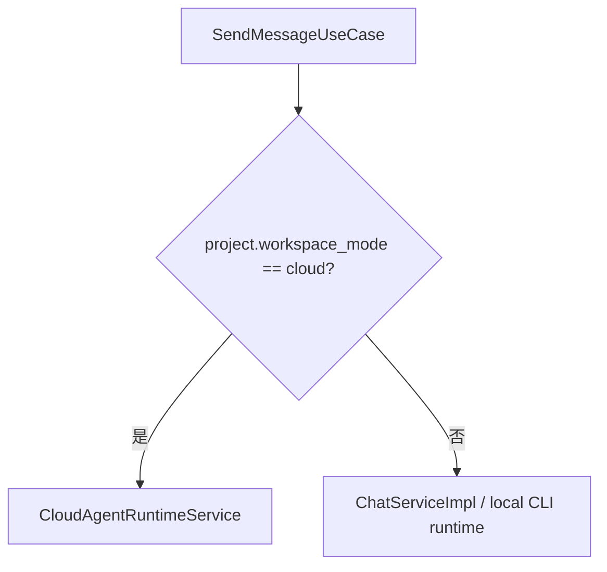

# AgentHub 当前架构总览

> 本文档描述 AgentHub 当前系统架构事实。整体架构约束见 `docs/adr/0005-target-architecture.md`，专项决策见 `docs/adr/`，产品需求见 `docs/PRD/`。

## 架构结论

AgentHub 当前采用六层架构：

1. 前端层
2. API 接入层
3. 应用服务层
4. 领域层
5. 基础设施层
6. 数据持久化层

## 目标架构图

## 分层说明

### 前端层

前端层负责所有用户可见界面、交互状态和后端通信。它不承载后端业务规则，也不直接访问数据库或外部 runtime。

当前职责：

- 三端产品入口：Web、桌面端、移动端。
- 聊天输入、消息列表、群聊协作面板、运行状态展示。
- Artifact 预览、审批、编辑入口和消息级 Artifact 卡片。
- 前端状态管理、请求状态、错误状态和本地 UI 状态。
- REST、SSE、WebSocket client。

当前主要模块：

| 能力 | 位置 |
| --- | --- |
| Web 前端 | `frontend/src/` |
| 桌面端壳 | `desktop/` |
| 移动端壳 | `mobile/` |
| 聊天和消息 UI | `frontend/src/components/`, `frontend/src/pages/` |
| 前端状态管理 | `frontend/src/stores/` |
| 后端 API client | `frontend/src/api/` |

### API 接入层

API 接入层负责协议接入和请求边界处理，保持薄层。它接收前端请求，完成认证、租户校验、参数校验和响应序列化，然后委托应用服务层。

当前职责：

- REST endpoint。
- SSE 流式响应入口。
- WebSocket 连接入口。
- 请求 DTO 校验和响应 DTO 序列化。
- 认证、租户校验、权限校验。
- 将用户命令转交给应用服务层。

当前主要模块：

| 能力 | 位置 |
| --- | --- |
| API 路由 | `backend/app/api/` |
| FastAPI 应用入口 | `backend/app/main.py` |
| Chat/SSE 接入 | `backend/app/api/chat.py` |
| WebSocket 接入 | `backend/app/api/ws.py` |
| API DTO | `backend/app/services/schemas.py` |

### 应用服务层

应用服务层是后端业务流程编排中心。它负责把一次用户意图拆成对领域规则、基础设施能力和数据持久化能力的协作调用。

当前职责：

- 单聊、群聊、local/cloud runtime 分流。
- Run / RunTask / RunProcess 状态推进。
- 消息创建、流式输出、最终消息落库。
- Artifact 扫描、版本、审批、交付工作流。
- 调用领域层完成 Orchestrator、上下文、Agent 选择和执行计划。
- 调用基础设施层执行 CLI、sandbox、workspace、event/realtime、deployment 等外部能力。
- 调用数据持久化层读取和保存 Project、Session、Message、Artifact、Run 等状态。

当前主要模块：

| 能力 | 位置 |
| --- | --- |
| 用户发消息用例 | `backend/app/application/send_message.py` |
| Agent ORM 到领域快照映射 | `backend/app/application/agent_profile_mapper.py` |
| 聊天主服务 | `backend/app/services/chat_service_impl.py` |
| 单聊 CLI 流 | `backend/app/services/single_cli_chat_stream.py` |
| 群聊流程 | `backend/app/services/group_chat_stream.py` |
| 云端 runtime 聊天 | `backend/app/services/cloud_agent_runtime.py` |
| Run / Task 状态 | `backend/app/services/run_service.py` |
| Artifact 输出桥接 | `backend/app/services/artifact_output_bridge.py` |

### 领域层

领域层保存稳定业务规则。它不依赖 FastAPI、WebSocket、应用服务、真实 CLI 进程、文件系统、SQLAlchemy session、ORM 模型或数据库连接。

当前职责：

- Orchestrator pipeline。
- 上下文组装和 token 预算策略。
- Agent 选择策略。
- 执行计划生成和规范化。
- 群聊意图、模式和任务拆解规则。
- prompt policy 和领域状态转换规则。
- 领域事件名和领域输入/输出数据结构。

当前主要模块：

| 能力 | 位置 |
| --- | --- |
| Orchestrator V2 | `backend/app/domain/orchestrator_v2.py` |
| 领域 Agent 快照 | `backend/app/domain/agent_profile.py` |
| 领域事件契约 | `backend/app/domain/events.py` |
| Agent 选择 | `backend/app/domain/agent_selector.py` |
| 上下文管理 | `backend/app/domain/context_manager.py` |
| 执行计划 | `backend/app/domain/execution_planner.py` |
| 领域类型和策略 | `backend/app/domain/` |

### 基础设施层

基础设施层负责系统和外部世界的连接。它包括外部适配器、运行环境能力、事件/实时推送、配置、凭据、Secret 和 Provider Registry。

当前职责：

- CLI 工具适配：Claude Code、Codex、OpenCode、自定义 CLI。
- CLI 进程、stdout/stderr、ANSI 清洗、交互式确认、进程生命周期。
- Workspace 文件系统访问、文件变更检测、路径安全。
- Cloud sandbox / runtime / runner provider。
- Deployment provider。
- EventBus 和 RealtimePublisher。
- WebSocket/SSE 发布适配。
- Settings、credential、secret、provider registry。
- 系统启动时的依赖装配。

当前主要模块：

| 能力 | 位置 |
| --- | --- |
| CLI agent 适配 | `backend/app/agents/` |
| EventBus | `backend/app/event_bus/` |
| RealtimePublisher / WebSocket manager | `backend/app/infrastructure/realtime.py` |
| 领域事件到 EventBus 适配 | `backend/app/infrastructure/domain_event_publisher.py` |
| 系统配置 | `backend/app/config.py` |
| Workspace provider | `backend/app/services/workspace_provider.py` |
| Runner provider | `backend/app/services/runner_provider.py` |
| Deployment provider | `backend/app/services/deployment_provider.py` |
| CLI credential | `backend/app/services/cli_credential_service.py` |
| Secret 管理 | `backend/app/services/secret_service.py` |

配置、凭据和 Provider 选择属于基础设施层的运行环境能力：

| 能力 | 当前作用 |
| --- | --- |
| Settings | 环境变量、数据库连接、CORS、运行模式等配置输入 |
| Credential / Secret | CLI 凭据、API key、用户/团队级 Secret |
| Provider Registry | runner provider、deployment provider、storage provider 等实现选择 |
| 依赖装配 | 在系统启动和服务创建时，把配置、数据库连接、事件总线、实时发布器、外部适配器提供给上层 |

### 数据持久化层

数据持久化层负责业务状态和运行状态的长期保存、查询和迁移。

当前职责：

- SQLAlchemy ORM models。
- SQLite 数据库连接。
- migration runner。
- Project、Session、Message、AgentConfig、Artifact、Run、Workspace、Runtime、Delivery 等状态存储。
- 查询形状、分页、搜索和全文检索。
- 未来 PostgreSQL 迁移承接。

当前主要模块：

| 能力 | 位置 |
| --- | --- |
| ORM models | `backend/app/models/` |
| 数据库连接 | `backend/app/database.py` |
| migrations | `backend/migrations/` |
| message persistence | `backend/app/services/message_service_sqlalchemy.py` |
| migration runner | `backend/app/services/migration_runner.py` |

## 依赖规则

当前依赖规则：

- 前端层只访问 API 接入层。
- API 接入层只委托应用服务层，不直接编排领域规则、外部 runtime 或持久化流程。
- 应用服务层可以调用领域层、基础设施层、数据持久化层。
- 领域层不依赖 API 接入层、应用服务层、基础设施层和数据持久化层。
- 数据持久化层的 ORM 对象进入领域层前，必须由应用服务层映射为 `AgentProfileSnapshot` 等纯数据结构。
- 领域事件进入 EventBus 前，必须由基础设施适配器转换为具体 `EventType`。
- 基础设施层可以访问外部系统。
- 数据持久化层可以访问数据库。

## 主要请求链路

### 单聊链路

### 群聊链路

### Artifact 链路

### Local / Cloud 分流

## 产品入口形态

| 形态 | 说明 | 主要目录 |
| --- | --- | --- |
| 本机桌面端 | Tauri 桌面端，启动本地后端，管理本机 workspace 和 CLI 进程 | `desktop/` |
| Web / SaaS | 浏览器连接后端 API；可搭配云端 workspace / runtime | `frontend/` |
| 移动端 | Capacitor 产品壳，轻量查看、审批、预览 | `mobile/` |

## 当前权威文档

| 问题 | 文档 |
| --- | --- |
| 项目是什么、怎么运行 | `README.md` |
| 领域术语和当前状态 | `CONTEXT.md` |
| 整体目标架构约束 | `docs/adr/0005-target-architecture.md` |
| 为什么做专项决策 | `docs/adr/` |
| 当前架构事实 | `docs/architecture/` |
| 产品需求和范围 | `docs/PRD/` |
| 已完成 Phase 追溯 | `docs/archive/phases/` |
