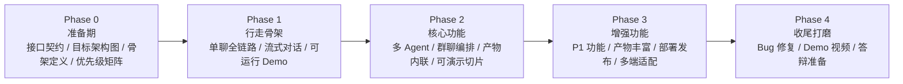

# ADR-0004: 开发方法论 —— 架构跑道 + 行走骨架 + 增量交付

**日期**: 2026-05-25
**状态**: Accepted

## 背景

项目采用结构化 vibe coding（ADR-0003），需要在"避免过度设计拖慢 MVP"和"避免架构粗糙导致返工"之间找到平衡点。需要选择一个适合小团队、有明确答辩截止日期、且需求边界基本清晰的项目管理方法。

## 决策

采用**三层混合开发模式**，三个方法论各解决一个层面的问题：

| 层面 | 方法论 | 来源 | 解决什么问题 |
|------|--------|------|-------------|
| **战略** | 架构跑道 (Architectural Runway) | SAFe 框架 | 每次迭代之前，先铺好本次迭代需要的架构"跑道"，不为远期需求过早投资 |
| **战术** | 行走骨架 (Walking Skeleton) | Alistair Cockburn | 第一轮编码就打通全链路（前端→API→Agent→数据库），验证架构抉择可行 |
| **节奏** | 增量交付 (Incremental Delivery) | 敏捷开发 | 每个迭代产出可演示的、完整的功能切片，而非堆砌零散功能点 |

### 核心原则

1. **架构按需生长**：Day 1 不铺满目标架构。每轮增量只在复杂度真正上升时引入新层/新模块，并以 ADR-0005 的六层架构约束为边界。
2. **接口先于实现**：模块边界用接口契约约束。契约一旦定义就尽量稳定；实现可以随意迭代、重写。
3. **每个增量都必须可演示**：不允许"做了 3 个后端模块但前端还没接"的中间态。每个增量结束时有可运行的 Demo。
4. **ADR 记录架构决策与约束**：每次引入新的架构层/模块时，写一条 ADR 记录它形成的核心设计、适用边界和后续开发约束。

### 何时引入新架构层（触发条件）

| 你在做什么 | 这时候才引入的模块 | 形成的约束 |
|-----------|-------------------|--------|
| Phase 1 行走骨架 | 只有 api + agent adapter + models | 单一链路，无复杂业务逻辑，不需要更多抽象 |
| 做消息引用/重生成/Pin | **Service 层** (MessageService, SessionService) | 业务逻辑开始跨多个 model，路由里塞不下了 |
| 做群聊/Orchestrator | **Event Bus** | 多 Agent 并发→结果聚合→前端推送，天然需要事件驱动 |
| 做产物预览/版本管理 | **Artifact Service** | 产物有独立生命周期，不再只是消息的附属字段 |
| 会话历史超 20 轮/Pin 系统 | **Context Manager** | Token 截断、历史压缩、优先级排序成为独立关注点 |

### 开发五阶段总览

### 禁止事项（来自 ADR-0003 的延伸）

- **禁止没有接口定义就开始写模块**：先写 Contract，再写实现
- **禁止提前建"以后可能用"的抽象**：Service 层、Event Bus、Context Manager 必须按触发条件引入
- **禁止增量结束时前端不可演示**：后端接口写好了但没接前端 = 本增量未完成
- **禁止跳过 Phase 0**：接口契约和行走骨架定义是写代码的前置条件

## 影响

- 前期做好架构设计准备，换来整个开发周期不偏航
- 每个阶段有明确的"完成"标准，不会出现"做了一大半但说不清楚做了什么"的答辩困境
- ADR 链路完整：答辩时可以展示从选型(0001)→目录(0002)→哲学(0003)→方法论(0004)的完整决策链
