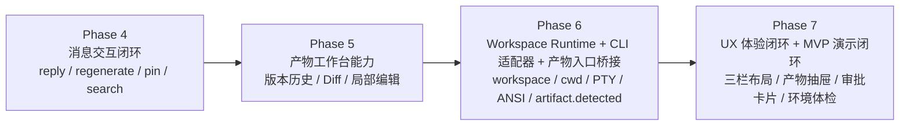
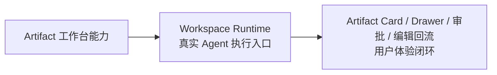
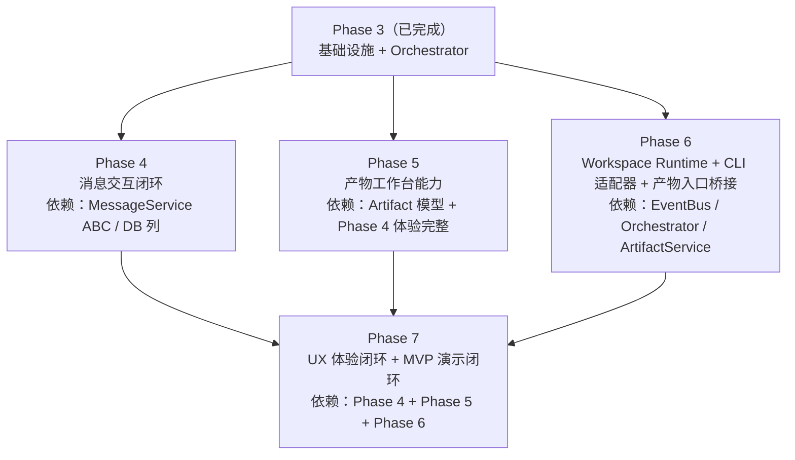

# ADR-0008: 修订开发策略 —— 功能板块制 + Phase 4-7 路线图

**日期**: 2026-06-02
**状态**: Accepted
**取代**: Phase 3 并行开发指南 (`docs/archive/phases/specs/planning/phase3-parallel-guide.md`), Phase 3 模块化计划 (`docs/archive/phases/specs/planning/phase3-modules.md`) 中的开发顺序部分
**修订**: 2026-06-03 文档覆盖审计后补充 PRD-05 端到端闭环要求。旧覆盖审计文件已在 2026-06-22 文档整理中删除；当前需求追踪以 [PRD-05](../../PRD/05-End_to_End_Product_Flow.md) 为准。

> **2026-06-04 修订说明**：Phase 6 重构后，HTTP API 伪 Agent 已被淘汰。用户可见 Agent 只保留 CLI Wrapper；DeepSeek 保留为后端内部系统模型，不进入 Agent 配置面。
>
> **2026-06-06 修订说明**：Phase 6F 验收后，P1 Artifact 体验从右侧 Drawer 调整为消息级 Artifact 卡片 + 页面级预览/编辑/版本管理，详见 [ADR-0010](0010-message-level-artifact-experience.md)。因此本文 §7 的旧 Phase 7 模块划分仅保留历史路线背景，当前 Phase 7 执行规格以 [docs/archive/phases/specs/phase7/README.md](../phases/specs/phase7/README.md) 为准。
>
> **2026-06-11 修订说明**：项目进入产品优化结尾状态后，早期开发阶段 Skill 已退役。本文中与 `agenthub-phase-wrapup` 相关的表述仅保留为历史策略背景，不再作为当前文档审计或阶段收尾流程入口。

---

## 1. 背景

### 1.1 问题诊断

Phase 3 采用"8 模块并行 + 增量叠加"的开发策略。经过完整执行，暴露出以下系统性问题：

| 问题 | 表现 | 根因 |
|------|------|------|
| **深度不均** | Orchestrator 投入 154 条测试、9 篇设计文档、全 DAG 可视化；消息操作/搜索/产物管理投入为 0 | 过早在一个方向深耕，忽略其他板块 |
| **板块空白** | Phase 3 Spec 规划的 8 个模块中，M2(消息操作)、M3(搜索)、M6(产物版本)、M7(在线编辑)、M8(收尾) 全部未动工 | "先做难的再补简单的"策略导致简单模块持续后延 |
| **架构偏离** | PRD 核心设计（CLI Agent 封装 via PTY/subprocess）完全未实现，代码走的是 HTTP API Adapter 路线 | Phase 3 的 Orchestrator 需求挤压了架构基础建设的时间 |
| **不可演示** | Phase 3 完成后，只有 Orchestrator 相关功能可演示。消息搜索、产物版本等用户直接感知的功能为零 | 违反了 ADR-0004 "每个增量都必须可演示"原则 |
| **文档熵增** | ADR 编号错位、Spec 文件平铺无层级、不存在的文件被多处引用 | 文档随代码增量滚动更新，缺乏周期性审计 |

### 1.2 核心洞察

> **当前策略的问题不是"做得太少"，而是"在一个方向做得太深，其他方向做得太浅"。**

Phase 3 的 Orchestrator 成果（Pipeline 四阶段、DAG 混合调度、6 角色模板、CollaborationPanel）是高质量的，但它占用了 Phase 3 的全部带宽，导致其他同等重要的功能板块处于零状态。后续开发必须纠正这种"单点深挖"的模式。

### 1.3 文档覆盖审计后的新增洞察

Phase 5 完成后再次对照启动文档、PRD 与 Specs，发现一个新的系统性问题：后续 Phase 虽然按功能板块推进，但文档没有充分描述每个 Phase 在全局产品链路中的定位。具体表现为 Phase 5 已完成 Artifact 版本/Diff/编辑工作台能力，但上游“Agent 输出如何生成 Artifact Card”、下游“Artifact 如何进入 Drawer、审批、回流修改”没有在早期文档中形成闭环。

因此，本 ADR 的“每个板块完整可演示”需要收紧为：每个板块不仅要完成自己的功能，还必须说明自己在北极星链路中的上游输入、下游输出、未覆盖边界。

---

## 2. 决策

### 2.1 新策略：功能板块制 (Functional Block System)

**核心原则**：

1. **每个 Phase = 一个独立的功能板块**。板块内包含该功能领域的全部子模块（后端 + 前端 + 测试）。
2. **板块内做到 PRD 级别完整**后才进入下一板块。不允许"所有板块都碰一点"。
3. **每个板块结束时必须有可演示的完整功能**。用户可以直接使用该板块的全部能力。
4. **板块之间按用户可感知价值排序**。优先实现用户能直接看到和使用的功能。
5. **架构基础板块放在中间**。既不因为架构洁癖阻塞 UX 功能，也不无限期推迟架构修正。

### 2.2 Phase 4-7 板块划分



Phase 5-7 的连续链路为：



### 2.3 每个板块的内部结构

每个 Phase 内部遵循统一模板：

```
Phase N/
├── README.md              ← 板块总览 + 验收标准清单
├── 01-<module-a>.md       ← 子模块 Spec
├── 02-<module-b>.md       ← 子模块 Spec
└── (可选) 03-<module-c>.md
```

每个子模块 Spec 必须覆盖：
- 在北极星链路中的位置、上游输入、下游输出、未覆盖边界
- 后端 API + Service + 数据模型
- 前端组件 + Store + 交互状态
- 测试标准（Unit + API + E2E 最低数量）
- 与其他 Phase 的接口契约

### 2.4 板块间依赖关系



Phase 4 和 Phase 5 之间没有强依赖，但建议串行完成以保证每板块的专注度。Phase 6 必须在 Phase 5 之后推进，因为它依赖 Phase 5 的 ArtifactService，并且要把 workspace 文件变更接入版本/Diff/编辑链路。

---

## 3. Phase 3 完成状态确认

Phase 3 更名为"Orchestrator + 基础设施"，其实际交付内容：

| 交付物 | 状态 | 说明 |
|--------|------|------|
| EventBus + 数据库迁移 + Service ABC | ✅ | Module 1 基础设施 |
| Orchestrator Pipeline (4 阶段) | ✅ | IntentAnalyzer + AgentSelector + TaskDecomposer + ExecutionPlanner |
| AgentExecutor (single/parallel/chain/dag) | ✅ | 含超时、中断、全失败兜底 |
| SharedContext + 中枢总结 | ✅ | 对话流共享 + 定向注入 + OrchestratorSummarizer |
| CollaborationPanel + Agent 角色气泡 | ✅ | DAG 可视化 + 角色标签 |
| SSE 协议 (6 + phase_change 事件) | ✅ | 前后端事件协议标准化 |
| Orchestrator 基础执行链路 | ✅ | Phase 3 当时基于 HTTP Adapter；Phase 6 已迁移为 CLI Wrapper 唯一路线 |

**未完成（移入后续 Phase）**：
- 消息 reply/regenerate/pin → Phase 4
- 消息全文搜索 → Phase 4
- 产物版本 + Diff → Phase 5
- 产物在线编辑 → Phase 5
- Workspace Runtime + CLI PTY 适配器 → Phase 6
- 三栏动态布局 → Phase 7

---

## 4. Phase 4: 消息交互闭环

**状态更新 (2026-06-02)**: Completed。实现与验收记录见 [Phase 4 Spec](../phases/specs/phase4/README.md) 和 [Phase 4 Dev Log](../phases/dev-logs/phase4-dev-log.md)。

### 4.1 目标

用户可以在聊天中引用历史消息、重新生成 AI 回复、Pin 关键上下文、全文搜索历史对话。

### 4.2 子模块

**Module 4A: 消息操作 (reply/regenerate/pin)**
- `POST /api/messages/{id}/reply` — 引用回复
- `POST /api/messages/{id}/regenerate` — SSE 流式重新生成
- `POST/DELETE /api/messages/{id}/pin` — Pin/Unpin
- `MessageActions.tsx` — hover 操作按钮栏
- `ReplyPreview.tsx` — 输入框引用卡片
- `SqlAlchemyMessageService` 实现 MessageService ABC

**Module 4B: 全文搜索 (FTS5)**
- `GET /api/messages/search?q=&session_id=&limit=` — FTS5 + LIKE fallback
- `SearchPanel.tsx` — 搜索框 + 结果列表 + 高亮跳转
- FTS5 中文分词支持

### 4.3 验收标准
- [x] 引用消息 → 气泡显示引用预览 → 点击跳转原消息
- [x] 引用消息不是 UI-only：`parentMessageId` + `metadata.replyReference` 落库，`[Reply context]` 注入 Agent 输入，真实 UI 验收证明 Agent 可感知引用内容
- [x] 重新生成 → 旧内容保留 + SSE 流式替换 → 超时回退
- [x] Pin 消息 → 上下文注入优先级 → 超出预算时自动淘汰最旧 Pin
- [x] 搜索中文关键词 → 返回高亮结果 → 点击跳转并闪烁定位
- [x] 所有操作在单聊和群聊中均可用

### 4.4 原始预估
- 后端: ~300 LOC (message_service_impl 补充 + search endpoint)
- 前端: ~400 LOC (MessageActions + ReplyPreview + SearchPanel)
- 测试: 30 条 (Unit 10 + API 12 + E2E 8)

---

## 5. Phase 5: 产物工作台能力

**状态更新 (2026-06-02)**: Completed。实现与验收记录见 [Phase 5 Spec](../phases/specs/phase5/README.md) 和 [Phase 5 Dev Log](../phases/dev-logs/phase5-dev-log.md)。

### 5.1 目标

产物（代码/文档/网页）拥有版本历史、可视化 Diff、支持选中区域局部编辑。

Phase 5 的边界：它完成的是对已有 Artifact 的工作台能力。Agent/CLI 输出自动生成 Artifact Card、右侧 Drawer 打开体验、审批卡片绑定 Artifact 由 Phase 6/7 补齐。

### 5.2 子模块

**Module 5A: 产物版本 + Diff**
- `GET /api/artifacts/{id}/versions` — 版本链查询
- `GET /api/artifacts/{id}/diff?v1=&v2=` — unified_diff
- `VersionHistory.tsx` — 版本下拉选择器
- `DiffViewer.tsx` — 左右对比/统一视图

**Module 5B: 产物在线编辑**
- `POST /api/artifacts/{id}/edit` — 选中片段修改
- `edit_artifact` tool schema → Agent Tool Calling 集成
- `CodeSelector.tsx` — 代码区域选中
- Diff 确认/拒绝 UI

### 5.3 验收标准
- [x] 产物重新生成/确认编辑后 → 自动创建新版本 → 版本选择器可回溯
- [x] 选择两个版本 → Diff 视图 → 增删行高亮
- [x] 选中代码片段 → 输入修改意图 → Agent 返回 Diff → 用户确认/拒绝
- [x] 不支持 tool_call 的 Agent → 降级为上下文注入

### 5.4 预估
- 后端: ~400 LOC
- 前端: ~500 LOC
- 测试: 45 条

---

## 6. Phase 6: Workspace Runtime + CLI 适配器 + 产物入口桥接

### 6.1 目标

实现 PRD-06 定义的 MVP 本机 Workspace Runtime，并在其上实现 PRD-01 定义的 CLI Agent 封装能力：通过 PTY/subprocess 管理真实 CLI 工具（Claude Code 等），支持 stdout 流式推送、ANSI 转义码清洗、交互式提示拦截。

同时补齐 PRD-05 定义的产物入口桥接：CLI Agent 输出的 HTML、代码块、patch、workspace 文件变更摘要必须能转换为标准 `artifact.detected` 事件，由 ArtifactService 统一创建 Artifact 与 Artifact Card。

### 6.2 子模块

**Module 6A: Workspace Runtime**
- `projects` 表 + `sessions.project_id`
- 本机 workspace 创建/绑定 + 路径安全
- 文件树、Diff、snapshot、静态预览
- 为 CLI Adapter 提供可信 `workspace_path`

**Module 6B: CLI Process Manager**
- `subprocess`/`PTY` 进程孵化与生命周期管理
- 使用 `workspace_path` 作为 CWD + 环境变量隔离
- 心跳超时 + 僵尸进程清理 (SIGTERM/SIGKILL)

**Module 6C: Stream Sanitizer (ANSI 清洗)**
- ANSI 转义码正则过滤
- 分块 SSE 推送（50ms 批量）
- 进度条/表格等复杂 TUI 组件的降级渲染

**Module 6D: Interactive Prompt Interception**
- 滑动窗口缓冲区 + 阻塞特征正则匹配（如 `(y/n)`）
- 暂停流推送 → 前端信令卡片 → stdin 回写唤醒

**Module 6E: CLI Agent Adapter (新增)**
- `CliAgentAdapter` 输出标准 CLI 事件
- 用户可见 Agent 只保留 CLI Wrapper（旧 HTTP Agent 数据归档/隐藏）

**Module 6F: Artifact Output Bridge**
- 检测 Agent 输出中的代码块、patch、文件变更摘要
- 发布 `artifact.detected` 事件
- ArtifactService 创建 Artifact，并触发聊天流 Artifact Card

### 6.3 验收标准
- [ ] 新建 Project 会绑定 workspace，并在 Session 上记录 `project_id`
- [ ] WorkspaceService 能返回文件树、Diff，并拒绝路径越界
- [ ] CLI 进程启动时的 `cwd` 必须等于当前 session 绑定的 `workspace_path`
- [ ] 后端启动 `claude` CLI → stdout 实时推流到前端 → 打字机效果流畅
- [ ] ANSI 颜色码被正确过滤 → 前端收到纯净 Markdown
- [ ] Claude Code 发出 `(y/n)` 确认 → 前端弹出交互卡片 → 用户点击后进程继续
- [ ] 用户关闭网页 → 3 分钟后进程被 SIGTERM
- [ ] 5 分钟无 stdout → 判定死锁 → SIGKILL
- [ ] CliAgentAdapter 可在 AgentPanel 中选择配置
- [ ] CLI Agent 输出 HTML/patch 或 workspace 文件变更 → 创建 Artifact → 聊天流出现 Artifact Card

### 6.4 预估
- 后端: ~950 LOC (workspace_service/provider + process_manager + stream_sanitizer + prompt_interceptor + cli_adapter + artifact_detection)
- 前端: ~300 LOC (Workspace 状态入口 + InteractivePromptCard + AgentPanel CLI 配置)
- 测试: 55 条

---

## 7. Phase 7: UX 体验闭环 + MVP 演示闭环

### 7.1 目标

实现 PRD-03 定义的三栏动态布局、产物抽屉、人工审批卡片、环境体检，全局 Store 拆分，UX 打磨。

同时跑通 PRD-05 定义的 MVP 演示脚本：workspace 绑定 → 输入任务 → Agent 输出 Artifact → 打开 Drawer → 编辑并确认新版本 → 审批继续 → 中枢总结。

### 7.2 子模块

**Module 7A: 动态三栏布局 + 产物抽屉**
- 右区 Artifact Drawer（宽度 0 → 40-50%，可拖拽）
- 抽屉内部：代码 Diff / 网页预览 双态切换
- 资产卡片增强（图标 + 版本号 + 预览/引用按钮）

**Module 7B: 人工审批断点**
- `requires_human_approval` → 任务状态 PAUSED
- 前端阻断卡片（红色警戒线 + 确认/驳回按钮）
- 输入框暂停遮罩（允许 @ 辩论）

**Module 7C: 环境体检卡片**
- 左栏底部：检测 Claude Code/Docker/Node.js 可用性
- 绿/红状态指示灯

**Module 7D: Store 拆分 + 全局 UX**
- chatStore / sessionStore / searchStore 独立文件
- P0/P1 UX 缺陷清零
- 全量回归测试

### 7.3 验收标准
- [ ] 点击资产卡片 [预览产物] → 右区抽屉滑出（40% 宽度）→ 可拖拽调整宽度
- [ ] 抽屉内 [网页预览] 模式 → IFrame 真实渲染
- [ ] 抽屉内 [代码 Diff] 模式 → Monaco 并排对比
- [ ] 审批断点触发 → 聊天流底部阻断卡片 → 用户确认后流水线继续
- [ ] 环境体检卡片 → 实时检测 → 异常时红字告警
- [ ] 全量回归零失败
- [ ] MVP 演示脚本端到端跑通

### 7.4 预估
- 后端: ~250 LOC
- 前端: ~600 LOC
- 测试: 25 条

---

## 8. 策略对比

| 维度 | 旧策略 (Phase 3) | 新策略 (Phase 4-7) |
|------|-----------------|-------------------|
| **组织方式** | 8 模块并行，按复杂度分配 | 4 板块串行，按用户价值排序 |
| **完成标准** | 模块独立交付 | 板块内全功能可演示 |
| **文档结构** | 平铺在 specs/ 根目录 | 每个 Phase 独立目录 |
| **架构基础** | 推迟到"以后" | Phase 6 专项修正 |
| **UX 优先级** | 最后 (M8 收尾) | Phase 7 独立板块，并承担 MVP 演示闭环 |
| **Orchestrator 深度** | 过度投入（154 条测试） | 已完成，不再追加 |
| **跨模块依赖** | 复杂矩阵 (见旧 parallel-guide) | 简化：Phase N 只依赖 Phase N-1 和 Phase 3 |

---

## 9. 文档治理规则（新增）

为保持文档脉络清晰，制定以下周期性质控规则：

1. **Phase 结束时审计**：每个 Phase wrap-up 时检查所有 docs/ 下的交叉引用是否有效
2. **ADR 编号与文件名一致**：`NNNN-title.md` 内部标题必须是 `ADR-NNNN`
3. **Spec 文件必须被 CONTEXT.md 索引**：不被索引的 Spec = 不会被 AI 发现 = 无效文档
4. **旧文档立即归档或删除**：不再适用的文档移入 `docs/archive/`，不留在原位产生混淆
5. **一个事实一个权威源**：同一信息不出现在两个地方。如果需要引用，用链接，不复制。

---

## 10. Consequences

- Phase 4-7 每个板块严格独立，不允许跨板块同时开发
- Phase 3 的 Orchestrator 成果被冻结为基础设施，后续板块在其上构建但不再追加 Orchestrator 功能
- Workspace Runtime + CLI 适配器（Phase 6）替换旧 HTTP 伪 Agent 路线；Phase 6 同时承担 Agent 输出和 workspace 文件变更到 Artifact 的入口桥接
- Phase 7 不只是 UX 打磨，必须以 PRD-05 的 MVP 演示脚本作为最终完成标准
- 文档周期性审计改由当前 Rules 与人工验收流程约束；`agenthub-phase-wrapup` 仅作为历史流程资产保留
- CONTEXT.md 的 Phase 描述从五阶段更新为七阶段模型
