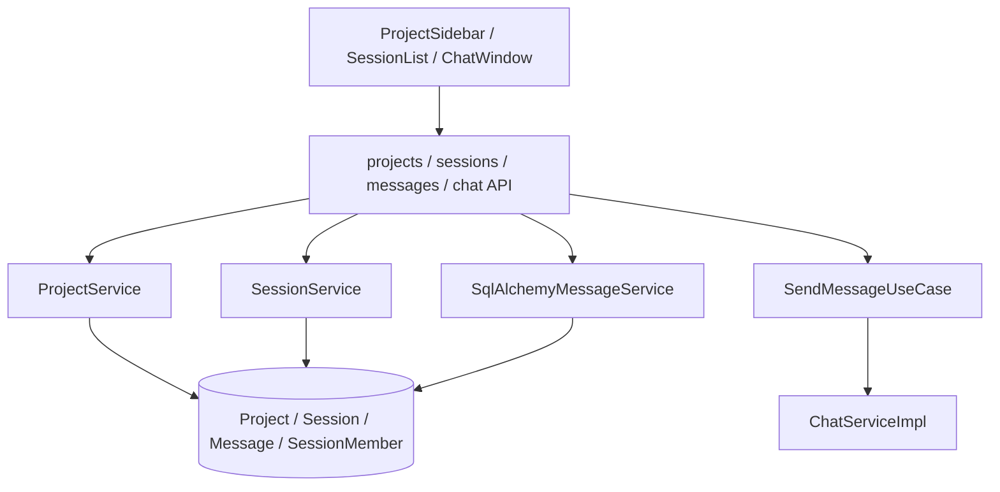

# 01 Project 与 IM 会话系统

## 模块定位

Project 与 IM 会话系统是 AgentHub 的入口模块。它把“项目工作区”“单聊/群聊”“消息历史”“Agent 成员”和“文件产物”收敛到 Project-first 的协作模型中，避免出现无归属聊天、无工作目录执行或产物无法追溯的问题。

该模块对应用户的第一条主链路：

```text
创建 Project
  -> 绑定本机 workspace 或云端 workspace
  -> 在 Project 下创建单聊 / 群聊
  -> 发送消息
  -> 消息进入 Agent / Orchestrator 执行链路
```

## 核心职责

1. Project 是顶层组织边界，所有 Session、Message、Agent 执行、Artifact、Run、Deployment 都应能追溯到 Project。
2. Session 只存在于 Project 下，分为单聊和群聊。
3. Message 保存用户输入、Agent 输出、系统整理消息、引用、Pin、附件和 Artifact 关联。
4. 群聊通过 session members 管理参与 Agent。
5. 本机 Project 绑定 `workspace_path`；云端 Project 绑定 cloud workspace 逻辑标识。

## 架构设计



API 层保持薄层，只负责认证、租户校验、参数校验和响应序列化；Project、Session、Message 的业务规则由 Service 层承载。

## 核心实现逻辑

Project 创建时，`ProjectService` 负责校验名称、workspace 模式、workspace 路径和删除安全边界。本机项目支持新建空白目录，也支持通过系统目录选择器授权已有目录。路径授权通过 folder token 传递，避免前端直接伪造任意本机路径。

Session 创建时，`SessionService` 校验 Project 是否存在，按模式创建单聊或群聊。群聊成员通过 `session_members` 关系绑定 Agent Config，后续群聊调度只在这些成员中选择 Agent。

消息发送时，`SendMessageUseCase` 是应用层入口。它读取 session 和 project 上下文，判断 local/cloud 分流，然后委托 `ChatServiceImpl` 或云端 runtime。消息的历史、引用、Pin、搜索和元数据由 `SqlAlchemyMessageService` 管理。

## 关键代码入口

| 职责 | 文件 |
| --- | --- |
| Project API | `backend/app/api/projects.py` |
| Session API | `backend/app/api/sessions.py` |
| Message API | `backend/app/api/messages.py` |
| Chat API / SSE | `backend/app/api/chat.py` |
| Project 服务 | `backend/app/services/project_service.py` |
| Session 服务 | `backend/app/services/session_service.py` |
| Message 持久化 | `backend/app/services/message_service_sqlalchemy.py` |
| 发消息用例 | `backend/app/application/send_message.py` |
| 聊天主服务 | `backend/app/services/chat_service_impl.py` |
| 前端 Project/Session UI | `frontend/src/components/ProjectSidebar.tsx`, `frontend/src/components/SessionList.tsx`, `frontend/src/components/ChatWindow.tsx` |
| 前端状态 | `frontend/src/stores/sessionStore.ts`, `frontend/src/stores/chatStore.ts` |

## 数据模型

| 表/模型 | 作用 |
| --- | --- |
| `projects` | Project 名称、workspace 模式、workspace 路径或云端 workspace 元数据。 |
| `sessions` | 单聊/群聊会话，归属 Project。 |
| `session_members` | 群聊中的 Agent 成员关系。 |
| `messages` | 用户消息、Agent 消息、系统消息、引用、Pin、Artifact 元数据。 |
| `messages_fts` | 消息全文搜索索引。 |

## 关键设计约束

1. 不存在无 Project 的聊天。
2. Agent 执行的 `cwd` 来自 Project，而不是 Session。
3. 前端只通过 API 访问 Project 和文件，不直接访问本机文件系统。
4. Reply 和 Pin 不能只是 UI 状态，必须进入 Message metadata 并参与 prompt 上下文。
5. 搜索、归档、未读、转发等 IM 能力不改变 Project-first 边界。

## 与其他模块的关系

| 下游模块 | 关系 |
| --- | --- |
| Agent Profile 与 CLI Runtime | Session 选择 Agent，CLI 以 Project workspace 为执行目录。 |
| Orchestrator 多 Agent 调度 | 群聊成员和用户消息是 Orchestrator 的输入。 |
| Workspace 与 Run 状态管理 | Project workspace 和 session message 驱动 Run/Task/Process。 |
| Artifact 产物链路 | Artifact 绑定 Project、Session、Message 和 Task。 |
