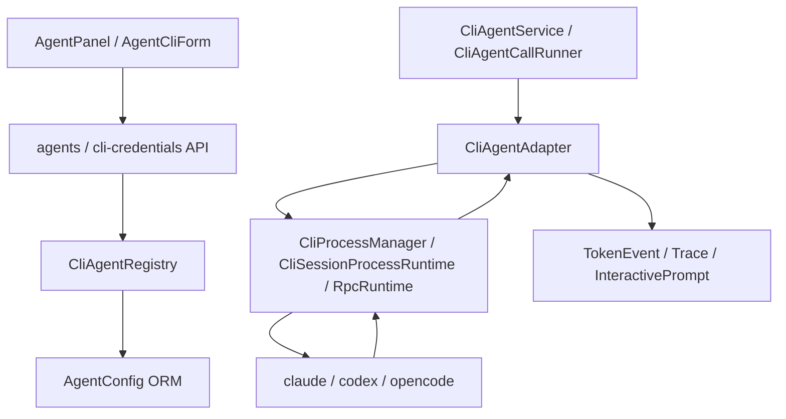

# 02 Agent Profile 与 CLI Runtime

## 模块定位

Agent Profile 与 CLI Runtime 是 AgentHub 区别于普通 LLM 聊天应用的核心模块。系统不把 HTTP LLM API 包装成“伪 Agent”，而是把 Claude Code、Codex、OpenCode 等真实 CLI 工具封装为可配置、可执行、可观测的 Agent Runtime。

```text
Agent Profile
  = System Prompt
  + Rules
  + Toolset
  + Context Policy
  + Runtime Config
  + Engine
```

## 核心职责

1. 管理用户可见 Agent Profile，而不是只管理模型名。
2. 为不同 CLI Engine 提供统一 Agent 调用接口。
3. 启动、复用、终止本机 CLI 进程。
4. 解析 stdout/stderr、工具调用、进度、交互式确认和错误。
5. 将 CLI 输出标准化为聊天 token、trace、Artifact 候选和 interactive prompt。
6. 支持 Engine Session 复用，让单聊或群聊中的 Agent 可延续底层 CLI 会话。

## 架构设计



Agent Profile 属于数据和产品模型；CLI Adapter 属于基础设施层；应用服务通过统一 Runner 调用，不直接理解每个 CLI 的私有协议。

## 核心实现逻辑

Agent 配置由 `backend/app/api/agents.py` 暴露创建、更新、删除、默认模板初始化和 executable 检查接口。Agent Config 保存名称、描述、system prompt、CLI 工具、启动参数、环境变量、能力标签等信息。

执行时，`CliAgentService` 或 `CliAgentCallRunner` 将消息上下文渲染为 CLI prompt，并根据 Agent 的 CLI tool 选择对应 Adapter。`CliAgentAdapter` 负责处理不同 CLI 的启动参数、session resume 参数、stdout 事件格式和错误识别。底层进程由 `CliProcessManager` 或 session runtime 管理。

输出流经过三层处理：

1. `StreamSanitizer` 清洗 ANSI 和控制字符。
2. `CliOutputParser` / Adapter 专属解析器把 stdout/stderr 转为标准事件。
3. `cli_trace.py` 将工具调用、命令、进度和错误转为前端可展示 trace。

## 关键代码入口

| 职责 | 文件 |
| --- | --- |
| Agent API | `backend/app/api/agents.py` |
| CLI 凭据 API | `backend/app/api/cli_credentials.py` |
| Agent Registry | `backend/app/services/cli_agent_registry.py` |
| CLI Agent 服务 | `backend/app/services/cli_agent_service.py` |
| 群聊 Agent 调用 Runner | `backend/app/services/cli_agent_executor.py` |
| Engine Session 服务 | `backend/app/services/engine_session_service.py` |
| CLI Adapter 基类与具体实现 | `backend/app/agents/cli_adapters.py` |
| CLI 进程管理 | `backend/app/agents/cli_runtime.py` |
| 常驻进程 Runtime | `backend/app/agents/cli_session_runtime.py`, `backend/app/agents/cli_rpc_session_runtime.py` |
| 输出解析 | `backend/app/agents/cli_output_parser.py`, `backend/app/agents/cli_trace.py` |
| 前端 Agent 配置 | `frontend/src/components/AgentPanel.tsx`, `frontend/src/components/AgentCliForm.tsx` |

## 支持的 Engine

| Engine | Adapter | 特点 |
| --- | --- | --- |
| Claude Code | `ClaudeCodeAdapter` | 支持 Claude CLI 参数、工具调用事件、权限确认、session resume。 |
| Codex | `CodexAdapter` | 支持 Codex exec / MCP server 形态、provider 配置、stderr 信号解析。 |
| OpenCode | `OpenCodeAdapter` | 支持 OpenCode run / ACP 形态、session 参数和输出解析。 |

## 数据与配置

| 模型/配置 | 作用 |
| --- | --- |
| `agent_configs` | 保存 Agent Profile、Engine、启动参数、能力标签和运行配置。 |
| `engine_sessions` | 保存底层 CLI session id，用于恢复上下文。 |
| CLI credential config | 保存 CLI provider、base URL、模型、env key 等运行配置。 |
| Secret / env | API key、代理 key、CLI 运行环境变量。 |

## 关键设计约束

1. 用户可见 Agent 不是 Provider，也不是裸 CLI 工具。
2. 每个 CLI 单独适配，不用一个通用正则硬解析所有工具输出。
3. CLI 工具由用户或云端环境安装，AgentHub 管理配置和运行时封装。
4. DeepSeek 等系统模型只用于标题、中枢总结、Artifact 编辑辅助，不作为用户可聊天 Agent。
5. 输出必须标准化为事件，前端不直接理解各 CLI 原始 stdout。

## 与其他模块的关系

| 下游模块 | 关系 |
| --- | --- |
| Project 与 IM 会话系统 | Agent 在 Session 中被选择或作为群聊成员出现。 |
| Workspace 与 Run 状态管理 | CLI 进程以 Project workspace 为 `cwd`，运行状态写入 Run/Task/Process。 |
| Artifact 产物链路 | CLI 输出和文件变化会被 Artifact Bridge 扫描。 |
| 审批与人工控制 | CLI 交互式提示会转成前端审批卡片或 interactive prompt。 |
