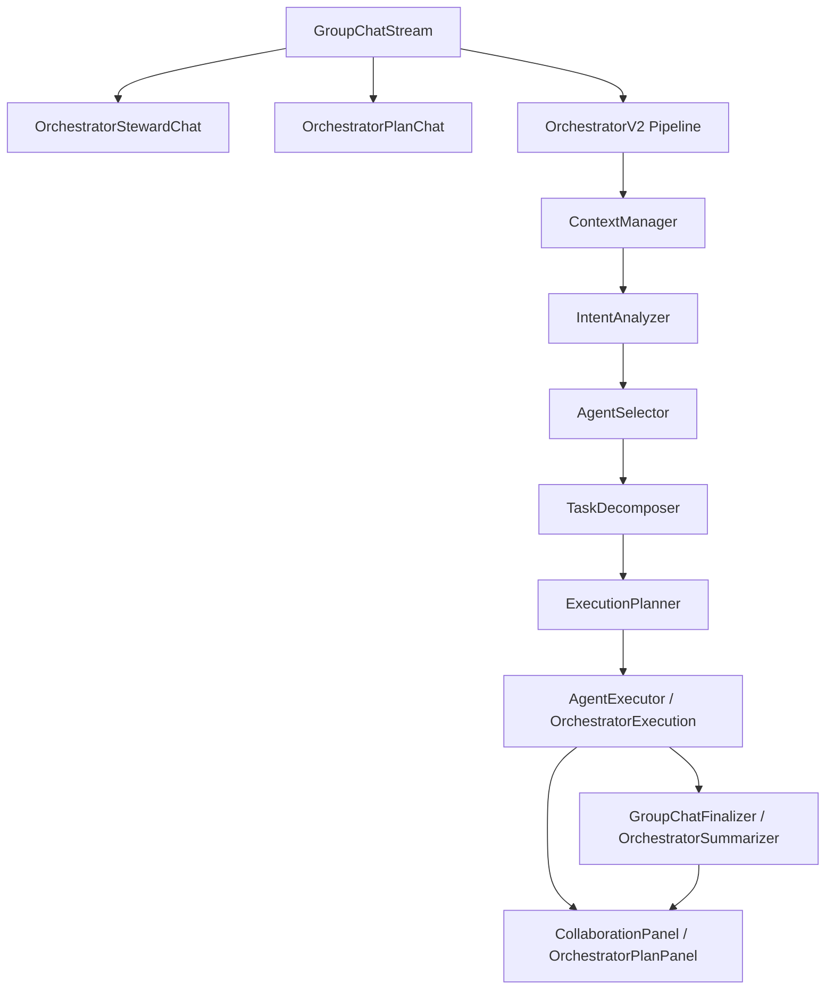

# 03 Orchestrator 多 Agent 调度

## 模块定位

Orchestrator 多 Agent 调度模块是 AgentHub 的“大脑”。它负责把用户在群聊中提出的目标转成可执行计划、任务依赖、Agent 分工和中枢总结，让多个 Agent 像项目小队一样协作，而不是简单并行回复。

## 核心职责

1. 分析用户意图，判断是普通问答、指定 Agent、调度请求还是审批/续跑操作。
2. 组装上下文，包含历史消息、Pin、Reply、Agent 成员和 Project 信息。
3. 根据 Agent Profile 能力选择候选 Agent。
4. 将复杂任务拆解为子任务，并生成 chain / parallel / DAG 执行计划。
5. 驱动计划执行、暂停、恢复、取消和人工确认。
6. 汇总多个 Agent 的产出，生成 Orchestrator 中枢总结。

## 架构设计



领域层负责纯决策，应用服务层负责任务执行和状态推进，前端负责展示计划、DAG、Agent 输出和最终总结。

## 核心实现逻辑

群聊消息进入 `GroupChatStream` 后，系统先判断是否需要调度器管家接管。`OrchestratorStewardChat` 处理不 @ 时的分流，避免旧逻辑直接自动路由。对于明确调度请求，系统进入 Plan-first 或 Orchestrator V2 Pipeline。

`OrchestratorV2` 的核心 pipeline 包括：

1. Context Assembly：调用 `ContextManager` 组装上下文和 token 预算。
2. Agent Selection：调用 `IntentAnalyzer` 和 `AgentSelector` 选择候选 Agent。
3. Execution Planning：调用 `TaskDecomposer` 和 `ExecutionPlanner` 生成 single / parallel / chain / DAG 计划。
4. Lifecycle Events：发布任务开始、阶段变化、Agent 输出和完成事件。

Plan-first 链路由 `OrchestratorPlanService` 保存 plan，`OrchestratorExecutionRegistry` 管理执行实例。执行过程中，`CliTaskRunner` 或 `CloudCliTaskRunner` 启动具体 Agent，任务状态通过 SSE/WebSocket 推送给前端。

## 关键代码入口

| 职责 | 文件 |
| --- | --- |
| 群聊流式主流程 | `backend/app/services/group_chat_stream.py` |
| 调度器管家分流 | `backend/app/services/orchestrator_steward_chat.py` |
| Orchestrator Pipeline | `backend/app/domain/orchestrator_v2.py` |
| 上下文管理 | `backend/app/domain/context_manager.py` |
| 意图识别 | `backend/app/domain/intent_analyzer.py` |
| Agent 选择 | `backend/app/domain/agent_selector.py` |
| 任务拆解 | `backend/app/domain/task_decomposer.py` |
| 执行计划 | `backend/app/domain/execution_planner.py` |
| Plan 持久化 | `backend/app/services/orchestrator_plan_service.py` |
| Plan 执行 | `backend/app/services/orchestrator_execution.py` |
| 群聊最终总结 | `backend/app/services/group_chat_finalizer.py`, `backend/app/services/orchestrator_summarizer.py` |
| Orchestrator API | `backend/app/api/orchestrator.py` |
| 前端调度展示 | `frontend/src/components/CollaborationPanel.tsx`, `frontend/src/components/OrchestratorPlanPanel.tsx`, `frontend/src/components/OrchestratorExecutionPanel.tsx` |

## 数据与状态

| 数据 | 作用 |
| --- | --- |
| `orchestrator_plans` | 保存 draft plan、步骤、状态和恢复点。 |
| `runs` / `run_tasks` / `run_processes` | 保存执行链路的用户请求、任务节点和底层进程。 |
| `messages.metadata` | 保存 Orchestrator 输出、Agent trace、Artifact 关联和执行上下文。 |
| `context_packs` | 保存跨 Agent 传递的摘要、引用和上下文片段。 |

## 事件与前端展示

Orchestrator 相关事件通过 SSE / WebSocket 推送，前端用于展示协作状态：

```text
orchestrator.route
orchestrator.task_started
orchestrator.phase_change
agent.start
agent.output
agent.done
approval.created
artifact.created
```

`CollaborationPanel` 展示 DAG 和 phase 状态，`MessageBubble` 展示各 Agent 输出，`GroupChatFinalizer` 生成中枢总结消息。

## 关键设计约束

1. Orchestrator 是特殊 Agent Profile，但执行机制仍由 Scheduler / Executor 读取计划后启动。
2. 任务拆解粒度是模块级或交付物级，不拆到“创建文件、写函数”。
3. 多 Agent 协作优先 DAG / chain，不退化为多个 Agent 独立气泡并列。
4. 计划执行必须支持人工确认、暂停、恢复和取消。
5. 领域层不依赖真实 CLI、数据库或 FastAPI。

## 与其他模块的关系

| 模块 | 关系 |
| --- | --- |
| Agent Profile 与 CLI Runtime | Orchestrator 选择 Agent，执行器启动对应 CLI Runtime。 |
| Project 与 IM 会话系统 | 群聊成员、消息历史和 Project workspace 是调度输入。 |
| Workspace 与 Run 状态管理 | 每个调度任务映射为 RunTask / RunProcess。 |
| Artifact 产物链路 | Agent 产出进入 Artifact Bridge。 |
| 审批与人工控制 | Plan 节点可进入 waiting / approval 状态。 |
