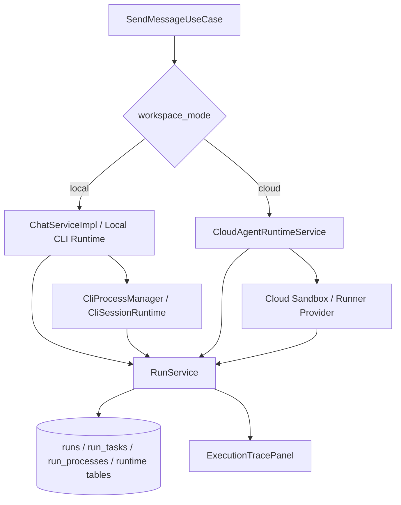

# 04 Workspace 与 Run 状态管理

## 模块定位

Workspace 与 Run 状态管理模块负责把“聊天中的一次请求”落到真实执行环境中。它管理 Project workspace、本机/云端 runtime 分流、Run/Task/Process 状态推进、CLI 进程生命周期和执行 trace，是 AgentHub 能够真实读写文件、运行命令和恢复长任务的基础。

## 核心职责

1. 为 Project 提供本机 workspace 或云端 workspace。
2. 确保所有 Agent 在 Project workspace 内执行。
3. 记录一次用户请求的 Run 状态。
4. 记录多 Agent / DAG 子任务的 RunTask 状态。
5. 记录底层 CLI 或 sandbox 进程的 RunProcess / RuntimeRun 状态。
6. 支持中止、恢复、重试、审批等待和执行 trace 展示。

## 架构设计

## 核心实现逻辑

`SendMessageUseCase` 读取 session 归属的 Project 后，根据 workspace 模式决定走本机 `ChatServiceImpl` 还是云端 `CloudAgentRuntimeService`。

本机执行时，CLI Runtime 以 `Project.workspace_path` 作为 `cwd` 启动真实进程。执行前后，`FileChangeDetector` 可以对 workspace 做快照和 diff，为 Artifact Bridge 提供文件变化线索。

状态管理由 `RunService` 负责。一次用户请求对应 `Run`，多 Agent 或 DAG 节点对应 `RunTask`，真实底层进程对应 `RunProcess` 或 runtime process。前端通过 `RuntimeControlStrip` 和 `ExecutionTracePanel` 展示状态并提供停止、查看日志、审批等入口。

云端执行时，`CloudWorkspaceProvider`、`SandboxService`、`RunnerProvider` 和 `CloudAgentRuntimeService` 共同提供 cloud workspace、sandbox ready、CLI 执行和日志回传。

## 关键代码入口

| 职责 | 文件 |
| --- | --- |
| 发消息分流 | `backend/app/application/send_message.py` |
| 本机聊天服务 | `backend/app/services/chat_service_impl.py` |
| 单聊 CLI 流 | `backend/app/services/single_cli_chat_stream.py` |
| 群聊执行流 | `backend/app/services/group_chat_stream.py` |
| Run 状态服务 | `backend/app/services/run_service.py` |
| Runtime schema | `backend/app/services/runtime_schemas.py` |
| CLI 进程管理 | `backend/app/agents/cli_runtime.py` |
| CLI session runtime | `backend/app/agents/cli_session_runtime.py`, `backend/app/agents/cli_rpc_session_runtime.py` |
| 文件变化检测 | `backend/app/services/file_change_detector.py` |
| Cloud workspace | `backend/app/services/cloud_workspace_provider.py` |
| Cloud runtime | `backend/app/services/cloud_agent_runtime.py`, `backend/app/services/cloud_cli_agent_service.py` |
| Sandbox / Runner | `backend/app/services/sandbox_service.py`, `backend/app/services/runner_provider.py` |
| Runtime API | `backend/app/api/runtime.py`, `backend/app/api/runs.py`, `backend/app/api/workspaces.py`, `backend/app/api/sandboxes.py` |
| 前端状态展示 | `frontend/src/components/ExecutionTracePanel.tsx`, `frontend/src/components/RuntimeControlStrip.tsx` |

## 状态模型

| 状态对象 | 粒度 | 说明 |
| --- | --- | --- |
| Run | 一次用户请求 | 表示整轮用户请求是否 queued / running / waiting / completed / failed / cancelled。 |
| RunTask | 一个 Agent 或 DAG 节点 | 表示子任务执行状态、依赖、审批等待和结果。 |
| RunProcess | 一个底层进程 | 表示 CLI 或 sandbox 进程的 pid、exit code、日志和 trace。 |
| EngineSession | 底层 CLI 会话 | 用于恢复 Claude/Codex/OpenCode 的长期会话上下文。 |

## 关键设计约束

1. 用户可见运行状态以 Run / RunTask 为准，底层进程状态不能直接替代业务状态。
2. 本机 CLI 的 `cwd` 必须来自 Project workspace。
3. 云端 workspace 使用逻辑 URI 或 workspace id，前端不暴露服务器物理路径。
4. 中止和恢复必须同时处理业务状态、CLI 进程和前端展示。
5. trace 是运行可观测性的核心数据，不应只保留纯文本输出。

## 与其他模块的关系

| 模块 | 关系 |
| --- | --- |
| Project 与 IM 会话系统 | Project 提供 workspace，Session 提供执行上下文。 |
| Agent Profile 与 CLI Runtime | Runtime 根据 Agent Profile 启动具体 CLI。 |
| Orchestrator 多 Agent 调度 | Orchestrator 的任务映射为 RunTask。 |
| Artifact 产物链路 | Run trace 和 workspace diff 是 Artifact 检测输入。 |
| 审批与人工控制 | RunTask 可进入 waiting / approval 状态。 |
