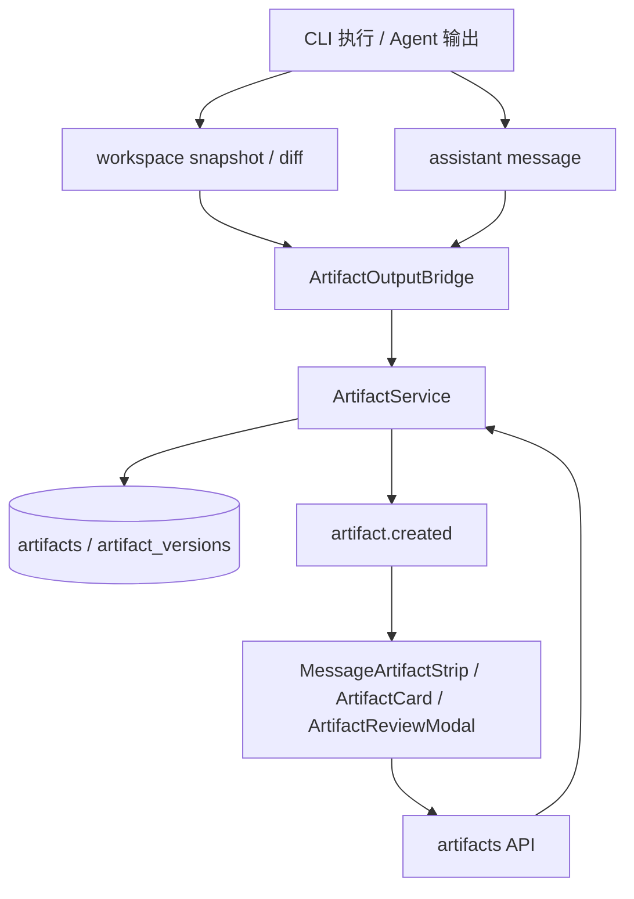

# 05 Artifact 产物链路

## 模块定位

Artifact 产物链路负责把 Agent 的输出变成可预览、可编辑、可版本化、可部署的产品资产。它不是前端扫描 Markdown 得到的装饰卡片，而是由后端标准事件、数据库记录和消息归属共同驱动的产物系统。

## 核心职责

1. 从 CLI 输出、消息代码块、workspace diff 和 trace 中识别产物候选。
2. 创建 Artifact 记录，并绑定 Project、Session、Message、Task。
3. 生成 `artifact.created` 标准事件，驱动消息级 Artifact Card。
4. 支持文件预览、网页预览、原始内容下载、资产路径代理。
5. 支持 Artifact 版本、Diff、编辑预览、保存和恢复。
6. 将 SaaS 云端 preview / deployment 状态也纳入 Artifact 展示链路。

## 架构设计

## 核心实现逻辑

Agent 执行完成后，系统会通过 `ArtifactOutputBridge` 扫描该消息关联的 trace、workspace 文件变化和消息正文。候选来源包括：

1. workspace 中新增或修改的 HTML、Markdown、代码、文档、文件树。
2. assistant 消息中的闭合代码块。
3. trace 中的文件路径提示。
4. 云端 preview 或 deployment 结果。

候选经过去重、评分和类型推断后，由 `ArtifactService` 创建 Artifact。Artifact 绑定 `message_id`，因此产物跟随具体 Agent 消息展示，而不是漂浮在全局工作台。

前端收到 `artifact.created` 后，在消息下方渲染 `MessageArtifactStrip` 和 `ArtifactCard`。用户点击后进入页面级 `ArtifactReviewModal`，可查看内容、预览网页、查看 Diff、切换版本、编辑并保存新版本。

## 关键代码入口

| 职责 | 文件 |
| --- | --- |
| Artifact API | `backend/app/api/artifacts.py` |
| Artifact 服务 | `backend/app/services/artifact_service.py` |
| 输出桥接 | `backend/app/services/artifact_output_bridge.py` |
| 预览推断 | `backend/app/services/artifact_preview.py` |
| Project preview | `backend/app/services/preview_service.py` |
| 文件变化检测 | `backend/app/services/file_change_detector.py` |
| Artifact 模型 | `backend/app/models/artifact.py` |
| 前端卡片 | `frontend/src/components/ArtifactCard.tsx`, `frontend/src/components/MessageArtifactStrip.tsx` |
| 前端预览/版本 | `frontend/src/components/ArtifactReviewModal.tsx`, `frontend/src/components/ArtifactVersionManager.tsx` |
| Diff 展示 | `frontend/src/components/DiffViewer.tsx` |

## Artifact 类型

| 类型 | 来源 | 展示方式 |
| --- | --- | --- |
| `code_diff` | 文件变化、代码块、trace | Diff 视图、代码编辑器。 |
| `web_preview` | HTML、前端入口、preview URL | iframe / 页面级网页预览。 |
| `document` | Markdown、文本、文档型输出 | 文档预览和编辑。 |
| `file_tree` | workspace 文件变化摘要 | 文件列表和变更入口。 |

## 数据与事件

| 数据/事件 | 作用 |
| --- | --- |
| `artifacts` | 保存产物标题、类型、内容、文件路径、归属关系和 preview 元数据。 |
| `artifact_versions` | 保存版本链、Diff、保存和恢复记录。 |
| `artifact.created` | 标准产物创建事件，驱动前端消息级卡片。 |
| `messages.metadata.artifacts` | 保留消息与产物的关联摘要。 |

## 关键设计约束

1. Artifact 必须绑定具体 message，不恢复 P1 右侧 Drawer 或独立产物工作台作为主路线。
2. 前端不能只靠扫描 Markdown 临时生成产物卡片。
3. 后端必须负责类型推断、候选去重、版本记录和路径安全。
4. 页面级预览/编辑弹窗是统一入口，聊天流只显示卡片摘要。
5. 文件读写必须受 Project workspace 边界约束。

## 与其他模块的关系

| 模块 | 关系 |
| --- | --- |
| Agent Profile 与 CLI Runtime | CLI 输出和 trace 是 Artifact 候选来源。 |
| Workspace 与 Run 状态管理 | workspace diff 和 run trace 提供产物检测线索。 |
| Project 与 IM 会话系统 | Artifact 绑定 Project、Session、Message。 |
| 审批与人工控制 | Approval Card 可关联 Artifact 供用户审阅。 |
| SaaS 云端协作与部署 | 云端 preview/deployment 可作为 Artifact 状态和链接展示。 |
