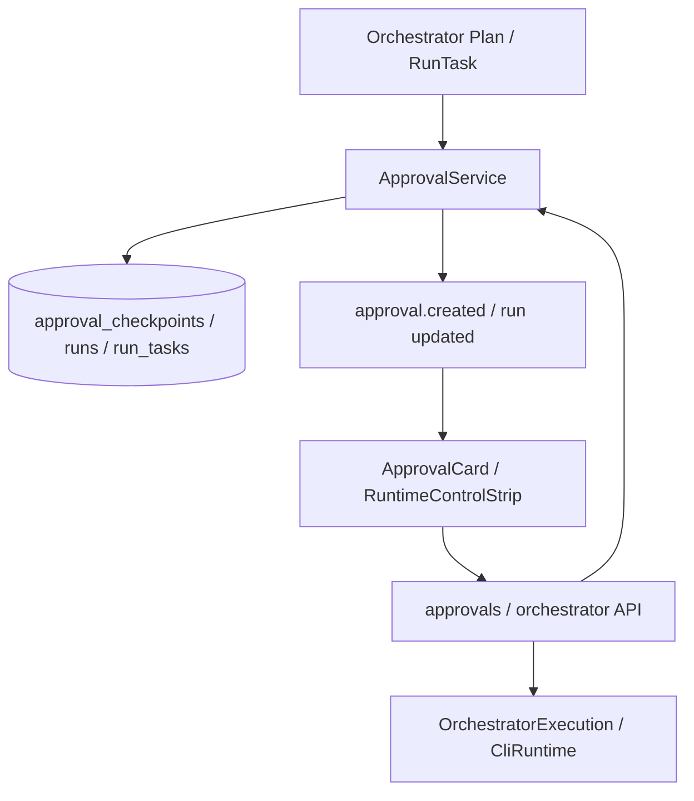

# 06 审批与人工控制

## 模块定位

审批与人工控制模块负责让 AgentHub 的自动化协作保持可控。多 Agent 调度、CLI 执行和产物修改可以自动推进，但关键节点必须支持用户审批、驳回、暂停、恢复、取消和交互式提示处理。

## 核心职责

1. 在 Orchestrator Plan 或 RunTask 需要人工确认时创建审批节点。
2. 在前端以 Approval Card 展示待审内容、关联任务和 Artifact。
3. 支持批准后续跑、驳回后回流修改原因。
4. 支持用户中止、恢复、取消 Orchestrator execution。
5. 将 CLI 的 y/n 或权限确认转成前端可操作的 interactive prompt。
6. 保留审批记录、操作人和审计信息。

## 架构设计

## 核心实现逻辑

审批点通常来自两类场景：

1. Orchestrator Plan 中某个任务声明 `needs_approval` 或执行策略要求人工确认。
2. CLI Runtime 在执行过程中遇到权限确认、交互提示或高风险动作。

`ApprovalService` 创建 checkpoint，保存 task、message、artifact、reason 和状态。前端收到事件后在聊天流展示 `ApprovalCard`。用户批准时，checkpoint 标记为 approved，并通知执行链路继续；用户驳回时，系统记录驳回原因，并把 Artifact / message 引用上下文回流给后续修订。

Orchestrator 执行控制由 `backend/app/api/orchestrator.py` 暴露 interrupt / resume / cancel / confirm 接口，底层执行状态由 `OrchestratorExecutionRegistry` 和 `RunService` 协同维护。

## 关键代码入口

| 职责 | 文件 |
| --- | --- |
| Approval API | `backend/app/api/approvals.py` |
| Approval 服务 | `backend/app/services/approval_service.py` |
| Approval 模型 | `backend/app/models/approval.py` |
| Orchestrator 控制 API | `backend/app/api/orchestrator.py` |
| Orchestrator 执行控制 | `backend/app/services/orchestrator_execution.py` |
| Run 状态服务 | `backend/app/services/run_service.py` |
| CLI 交互提示 | `backend/app/agents/cli_stream.py`, `backend/app/api/chat.py` |
| 前端审批卡 | `frontend/src/components/ApprovalCard.tsx` |
| 前端运行控制 | `frontend/src/components/RuntimeControlStrip.tsx`, `frontend/src/components/InteractivePromptCard.tsx` |

## 状态与事件

| 状态/事件 | 说明 |
| --- | --- |
| `pending` | 等待用户审批。 |
| `approved` | 用户批准，执行链路可继续。 |
| `rejected` | 用户驳回，修改原因回流到后续对话。 |
| `approval.created` | 创建审批卡片的实时事件。 |
| `interactive_prompt` | CLI 交互式提示事件。 |
| execution `interrupt/resume/cancel` | Orchestrator 执行控制动作。 |

## 关键设计约束

1. 审批不是普通 UI 按钮，必须持久化为 checkpoint。
2. 审批卡片必须绑定相关消息、任务和 Artifact，避免用户在历史中寻找上下文。
3. 驳回必须携带原因，并回流到修订上下文。
4. 中止、恢复、取消不能只改前端状态，必须同步后端执行状态和进程状态。
5. CLI 交互提示必须经过后端标准化，不让前端直接操作 stdin 细节。

## 与其他模块的关系

| 模块 | 关系 |
| --- | --- |
| Orchestrator 多 Agent 调度 | Plan 节点可进入 waiting / approval 状态。 |
| Workspace 与 Run 状态管理 | 审批会改变 RunTask 状态和执行推进。 |
| Artifact 产物链路 | 审批卡片可关联 Artifact 供用户审阅。 |
| Agent Profile 与 CLI Runtime | CLI 交互式提示转为人工确认。 |
| 多端产品壳与权限安全 | Mobile 端主要承载轻量审批和预览。 |
