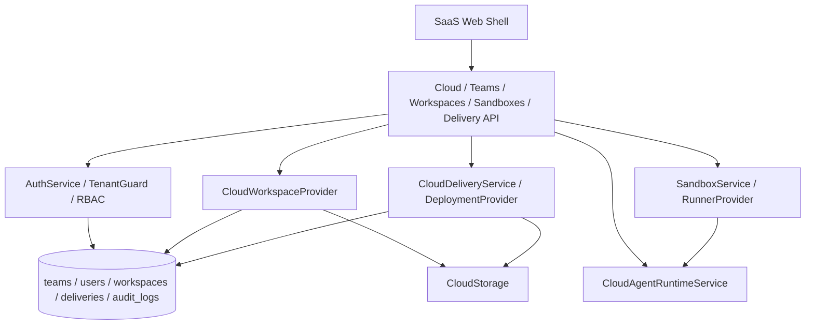

# 07 SaaS 云端协作与部署

## 模块定位

SaaS 云端协作与部署模块把本机桌面版的 Project、Agent、Artifact 能力扩展到云端。它负责团队协作、云端 workspace、sandbox runtime、云端 preview、deployment、一键发布和租户隔离。

## 核心职责

1. 管理团队、成员、角色和 RBAC。
2. 为 Project 提供 cloud workspace、导入、快照、恢复和审计。
3. 在云端 sandbox / runner 中执行 CLI Agent。
4. 管理云端 Secret、配额、日志和运行清理。
5. 为 Artifact 提供云端 preview URL。
6. 通过 deployment provider 发布可访问链接，并支持日志、回滚和移动端审批。

## 架构设计

## 核心实现逻辑

SaaS Web 入口通过 `SaasWebShell` 和 `AuthGate` 建立登录态。后端请求经过 `AuthService`、`TenantScope` 和 `TenantGuard`，确保用户只能访问所属团队和租户资源。

Cloud Workspace 由 `CloudWorkspaceProvider` 管理。Project 不暴露服务器物理路径，而是保存云端 workspace id 或逻辑 URI。用户可以导入仓库、创建快照、恢复 workspace，并通过审计日志追溯操作。

Cloud Runtime 由 `CloudAgentRuntimeService` 与 `SandboxService` / `RunnerProvider` 协同。云端执行保留与本机相同的 Agent Profile 和 Run/Task/Process 模型，但底层进程运行在云端 sandbox 中。

部署链路由 `CloudDeliveryService` 和 `DeploymentProvider` 管理。Artifact 或 Project build 可以生成 preview URL 和 deployment URL，记录日志、状态、release 和 rollback 信息。

## 关键代码入口

| 职责 | 文件 |
| --- | --- |
| SaaS Shell | `frontend/src/shells/saas/SaasWebShell.tsx`, `frontend/src/shells/saas/AuthGate.tsx` |
| Cloud workspace UI | `frontend/src/shells/saas/CloudWorkspaceSettings.tsx`, `frontend/src/shells/saas/SaasProjectSidebar.tsx` |
| Auth 服务 | `backend/app/services/auth_service.py` |
| Tenant Guard | `backend/app/services/tenant_guard.py` |
| Team 服务 | `backend/app/services/team_service.py` |
| Cloud workspace | `backend/app/services/cloud_workspace_provider.py`, `backend/app/services/cloud_storage.py` |
| Cloud runtime | `backend/app/services/cloud_agent_runtime.py`, `backend/app/services/cloud_cli_agent_service.py` |
| Sandbox / Runner | `backend/app/services/sandbox_service.py`, `backend/app/services/runner_provider.py` |
| Secret / Quota | `backend/app/services/secret_service.py`, `backend/app/services/quota_service.py` |
| Deployment | `backend/app/services/cloud_delivery_service.py`, `backend/app/services/deployment_provider.py` |
| Cloud APIs | `backend/app/api/workspaces.py`, `backend/app/api/sandboxes.py`, `backend/app/api/cloud_delivery.py`, `backend/app/api/teams.py`, `backend/app/api/auth.py` |

## 数据模型

| 模型 | 作用 |
| --- | --- |
| `users` / `teams` | SaaS 用户、团队、成员关系和角色。 |
| `workspace` 相关模型 | 云端 workspace 元数据、快照、导入来源。 |
| `runtime` / `run` 相关模型 | 云端 sandbox 和 CLI 执行状态。 |
| `delivery` / `build` | preview、deployment、release、rollback、日志。 |
| `audit_logs` | 团队、workspace、secret、部署等敏感操作审计。 |

## 关键设计约束

1. P1 本机版不依赖云端登录和团队。
2. SaaS 前端不暴露服务器物理路径，只暴露 workspace id 或逻辑 URI。
3. 云端运行必须做租户过滤、Secret 脱敏和配额控制。
4. SaaS 与本机版共享核心领域模型，但 runtime provider 不同。
5. Deployment provider 是可替换基础设施能力，不写死单一平台。

## 与其他模块的关系

| 模块 | 关系 |
| --- | --- |
| Project 与 IM 会话系统 | SaaS Project 仍遵循 Project-first 工作流。 |
| Agent Profile 与 CLI Runtime | 云端 Agent 使用同一 Profile 模型，但执行位置变为 sandbox。 |
| Workspace 与 Run 状态管理 | cloud workspace 和 cloud runtime 复用 Run/Task/Process 状态。 |
| Artifact 产物链路 | 云端 Artifact 可生成 preview 和 deployment 链接。 |
| 多端产品壳与权限安全 | SaaS Shell、Auth、TenantScope 是云端入口前置条件。 |
