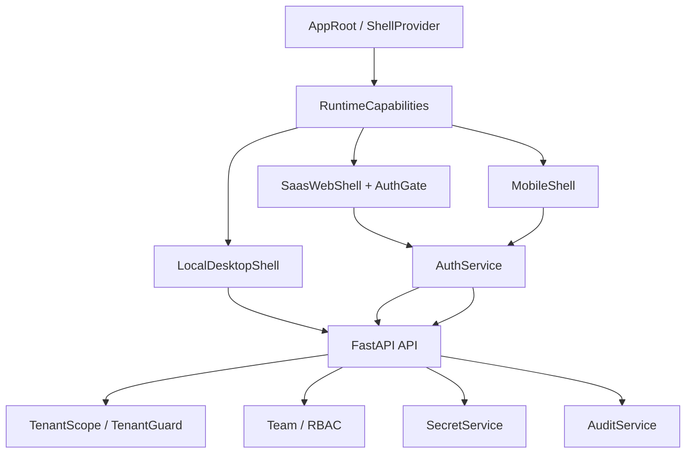

# 08 多端产品壳与权限安全

## 模块定位

多端产品壳与权限安全模块负责让同一套 AgentHub 核心能力在 Local Desktop、SaaS Web、Mobile 三种产品形态中以不同能力边界运行，并为云端团队协作提供 Auth、TenantScope、RBAC、Secret 和审计保护。

## 核心职责

1. 根据运行形态加载 Local / SaaS / Mobile shell。
2. 定义各端能力矩阵，避免移动端承载本机 CLI 或完整桌面工作区设置。
3. Local Desktop 作为本机特权层，启动本地后端并访问本机 workspace。
4. SaaS Web 通过登录态、团队、租户和云端 workspace 访问服务。
5. Mobile 端承载轻量查看、审批和 Artifact 预览。
6. 后端通过 Auth、TenantScope、RBAC、Secret、Audit 保护云端资源。

## 架构设计

## 核心实现逻辑

前端通过 `ShellProvider` 和 capabilities 判断当前运行形态。Local Desktop 使用本地后端和本机 workspace 能力；SaaS Web 进入登录门并使用云端 workspace；Mobile Shell 保留轻量审批和预览能力。

Local Desktop 的关键边界是本机特权执行：Tauri / Node.js 壳负责启动本地后端、打开 WebView，并允许后端 spawn 本机 CLI 进程。Web UI 本身仍通过 HTTP/SSE/WebSocket 和后端通信，不直接访问文件系统。

SaaS 和 Mobile 请求进入后端后，需要通过 Auth 和 TenantScope。`TenantGuard` 在 Project、Workspace、Artifact、Run、Secret、Delivery 等 cloud 资源访问前执行租户过滤。RBAC 控制团队成员权限，`SecretService` 管理敏感配置，`AuditService` 记录关键操作。

## 关键代码入口

| 职责 | 文件 |
| --- | --- |
| Shell Provider | `frontend/src/app/ShellProvider.tsx`, `frontend/src/app/capabilities.ts` |
| Local Desktop Shell | `frontend/src/shells/local/LocalDesktopShell.tsx`, `frontend/src/shells/local/LocalProjectSidebar.tsx` |
| SaaS Shell | `frontend/src/shells/saas/SaasWebShell.tsx`, `frontend/src/shells/saas/AuthGate.tsx` |
| Mobile Shell | `frontend/src/shells/mobile/MobileShell.tsx` |
| 桌面端工程 | `desktop/` |
| 移动端工程 | `mobile/` |
| Auth API / 服务 | `backend/app/api/auth.py`, `backend/app/services/auth_service.py` |
| Team / RBAC | `backend/app/api/teams.py`, `backend/app/services/team_service.py` |
| Tenant Guard | `backend/app/services/tenant_guard.py` |
| Secret | `backend/app/api/secrets.py`, `backend/app/services/secret_service.py` |
| Audit | `backend/app/api/audit_logs.py`, `backend/app/services/audit_service.py` |

## 能力矩阵

| 能力 | Local Desktop | SaaS Web | Mobile |
| --- | --- | --- | --- |
| 本机 workspace | 支持 | 不支持 | 不支持 |
| 本机 CLI 进程 | 支持 | 不支持 | 不支持 |
| 云端 workspace | 可作为远期入口 | 支持 | 查看/审批为主 |
| 云端 sandbox runtime | 不作为 P1 依赖 | 支持 | 不直接执行 |
| Artifact 预览 | 支持 | 支持 | 支持轻量预览 |
| Artifact 编辑 | 支持 | 支持 | 受限 |
| 审批 | 支持 | 支持 | 支持 |
| 团队/RBAC | 非必需 | 支持 | 支持 |

## 安全设计

| 安全点 | 实现思路 |
| --- | --- |
| 本机路径授权 | Project 创建时通过系统目录选择器或受控 workspace root。 |
| 租户隔离 | API 层和 Service 层使用 TenantScope / TenantGuard。 |
| RBAC | Team 成员角色决定 cloud 资源访问权限。 |
| Secret 管理 | SecretService 统一保存和读取敏感配置，避免明文扩散。 |
| 审计 | AuditService 记录团队、workspace、secret、部署等关键操作。 |
| 前端能力边界 | capabilities 控制不同 shell 可见入口和操作能力。 |

## 关键设计约束

1. P1 Local Desktop 必须能离线运行，不依赖 SaaS 登录。
2. Mobile 不承载本机 CLI、完整 workspace 设置和高风险执行配置。
3. SaaS 所有 cloud 资源访问必须有租户过滤。
4. 前端能力隐藏不能替代后端权限校验。
5. Secret、API key、CLI credential 不应进入普通日志或前端明文状态。

## 与其他模块的关系

| 模块 | 关系 |
| --- | --- |
| SaaS 云端协作与部署 | Auth、TenantScope、RBAC 是 SaaS 模块前置能力。 |
| Agent Profile 与 CLI Runtime | Local Desktop 支持本机 CLI，SaaS 使用云端 CLI runtime。 |
| Workspace 与 Run 状态管理 | 不同 shell 决定 workspace 和 runtime provider。 |
| 审批与人工控制 | Mobile 的核心职责之一是轻量审批和预览。 |
